# `phaeno_ops` database ERD

This document covers every table and column in the current application-owned EF Core model, plus the EF migration-history table in `public`. It is generated from [`PSeqOperationsDbContextModelSnapshot.cs`](../backend/app/Migrations/PSeqOperationsDbContextModelSnapshot.cs) and the configured migration-history table name.

PostgreSQL system schemas (`pg_catalog`, `information_schema`, and temporary/toast schemas) are intentionally excluded. This is a model-derived ERD; confirm the target database's applied migration list before using it as live-environment evidence.

## Legend and totals

- `PK` = primary key; `FK` = database-enforced foreign key; `UK` = column participating in a unique key or unique index.
- Each field comment states whether the database column is nullable.
- Relationship labels name the child foreign-key column or columns.
- Logical identifiers that cross module boundaries without a database foreign key remain ordinary fields and are not drawn as relationships.

| Schema | Entities | Fields | Foreign keys |
| --- | ---: | ---: | ---: |
| `public` | 1 | 2 | 0 |
| `commercial_ops` | 72 | 1125 | 113 |
| `lab_ops` | 27 | 307 | 38 |
| `website` | 2 | 18 | 0 |
| **Total** | **102** | **1452** | **151** |

## `public` schema

### EF migration history

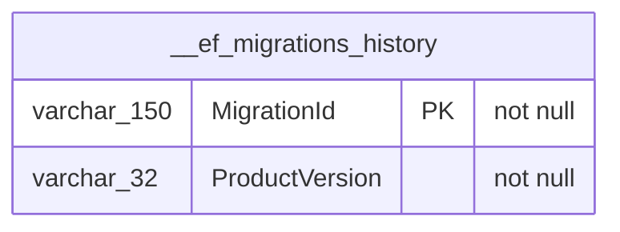
```mermaid
erDiagram
    __ef_migrations_history {
        varchar_150 MigrationId PK "not null"
        varchar_32 ProductVersion "not null"
    }
```

## `commercial_ops` schema

### Accounts and audit

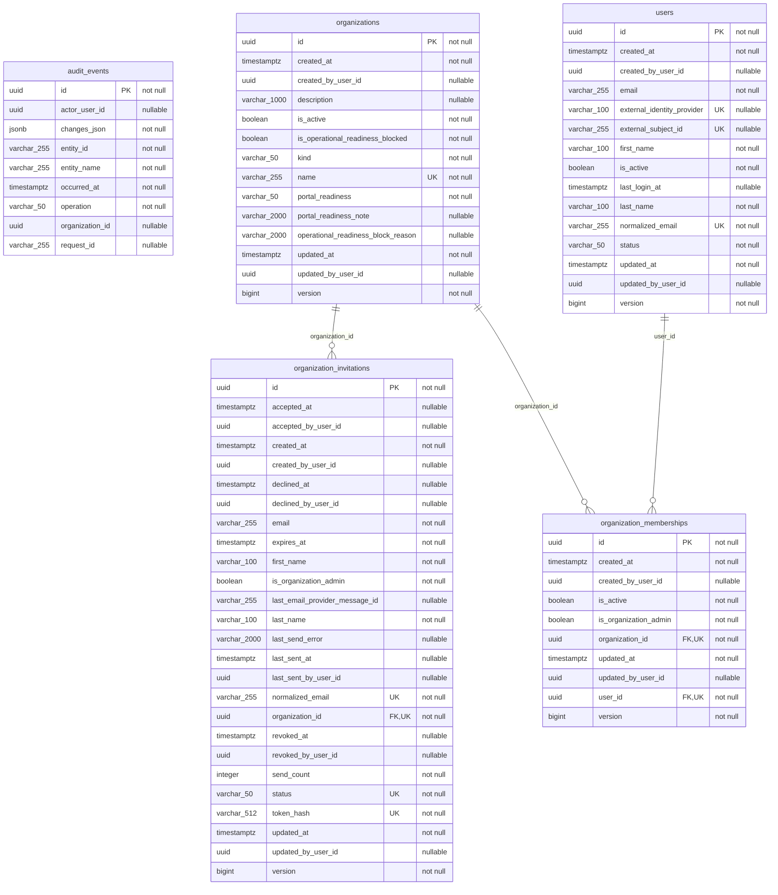
```mermaid
erDiagram
    audit_events {
        uuid id PK "not null"
        uuid actor_user_id "nullable"
        jsonb changes_json "not null"
        varchar_255 entity_id "not null"
        varchar_255 entity_name "not null"
        timestamptz occurred_at "not null"
        varchar_50 operation "not null"
        uuid organization_id "nullable"
        varchar_255 request_id "nullable"
    }
    organization_invitations {
        uuid id PK "not null"
        timestamptz accepted_at "nullable"
        uuid accepted_by_user_id "nullable"
        timestamptz created_at "not null"
        uuid created_by_user_id "nullable"
        timestamptz declined_at "nullable"
        uuid declined_by_user_id "nullable"
        varchar_255 email "not null"
        timestamptz expires_at "not null"
        varchar_100 first_name "not null"
        boolean is_organization_admin "not null"
        varchar_255 last_email_provider_message_id "nullable"
        varchar_100 last_name "not null"
        varchar_2000 last_send_error "nullable"
        timestamptz last_sent_at "nullable"
        uuid last_sent_by_user_id "nullable"
        varchar_255 normalized_email UK "not null"
        uuid organization_id FK,UK "not null"
        timestamptz revoked_at "nullable"
        uuid revoked_by_user_id "nullable"
        integer send_count "not null"
        varchar_50 status UK "not null"
        varchar_512 token_hash UK "not null"
        timestamptz updated_at "not null"
        uuid updated_by_user_id "nullable"
        bigint version "not null"
    }
    organization_memberships {
        uuid id PK "not null"
        timestamptz created_at "not null"
        uuid created_by_user_id "nullable"
        boolean is_active "not null"
        boolean is_organization_admin "not null"
        uuid organization_id FK,UK "not null"
        timestamptz updated_at "not null"
        uuid updated_by_user_id "nullable"
        uuid user_id FK,UK "not null"
        bigint version "not null"
    }
    organizations {
        uuid id PK "not null"
        timestamptz created_at "not null"
        uuid created_by_user_id "nullable"
        varchar_1000 description "nullable"
        boolean is_active "not null"
        boolean is_operational_readiness_blocked "not null"
        varchar_50 kind "not null"
        varchar_255 name UK "not null"
        varchar_50 portal_readiness "not null"
        varchar_2000 portal_readiness_note "nullable"
        varchar_2000 operational_readiness_block_reason "nullable"
        timestamptz updated_at "not null"
        uuid updated_by_user_id "nullable"
        bigint version "not null"
    }
    users {
        uuid id PK "not null"
        timestamptz created_at "not null"
        uuid created_by_user_id "nullable"
        varchar_255 email "not null"
        varchar_100 external_identity_provider UK "nullable"
        varchar_255 external_subject_id UK "nullable"
        varchar_100 first_name "not null"
        boolean is_active "not null"
        timestamptz last_login_at "nullable"
        varchar_100 last_name "not null"
        varchar_255 normalized_email UK "not null"
        varchar_50 status "not null"
        timestamptz updated_at "not null"
        uuid updated_by_user_id "nullable"
        bigint version "not null"
    }
    organizations ||--o{ organization_invitations : "organization_id"
    organizations ||--o{ organization_memberships : "organization_id"
    users ||--o{ organization_memberships : "user_id"
```

### Customer relationship management

```mermaid
erDiagram
    crm_companies {
        uuid id PK "not null"
        uuid access_organization_id FK,UK "nullable; internal Portal tenant scope"
        varchar_255 address_line1 "nullable"
        varchar_255 address_line2 "nullable"
        text_array aliases "not null"
        varchar_150 city "nullable"
        varchar_2 country_code "nullable"
        timestamptz created_at "not null"
        uuid created_by_user_id "nullable"
        varchar_2000 description "nullable"
        varchar_253 domain_name "nullable"
        integer employee_count "nullable"
        varchar_150 industry "nullable"
        boolean is_active "not null"
        varchar_50 lifecycle_state "not null"
        uuid merged_into_company_id FK "nullable"
        varchar_255 name "not null"
        uuid owner_user_id FK "not null"
        varchar_50 phone "nullable"
        varchar_30 postal_code "nullable"
        varchar_150 region "nullable"
        varchar_150 source "nullable"
        text_array tags "not null"
        timestamptz updated_at "not null"
        uuid updated_by_user_id "nullable"
        bigint version "not null"
        varchar_2048 website_url "nullable"
    }
    crm_contacts {
        uuid id PK "not null"
        text_array aliases "not null"
        varchar_1000 communication_notes "nullable"
        varchar_50 communication_preference "not null"
        timestamptz created_at "not null"
        uuid created_by_user_id "nullable"
        varchar_255 email "nullable"
        varchar_100 first_name "not null"
        boolean is_active "not null"
        varchar_150 legacy_job_title "nullable, read-only preservation"
        varchar_100 last_name "not null"
        varchar_255 lawful_contact_basis "nullable"
        uuid merged_into_contact_id FK "nullable"
        varchar_255 normalized_email "nullable"
        uuid owner_user_id FK "not null"
        varchar_50 phone "nullable"
        text_array tags "not null"
        timestamptz updated_at "not null"
        uuid updated_by_user_id "nullable"
        bigint version "not null"
    }
    crm_company_contacts {
        uuid id PK "not null"
        uuid company_id FK,UK "not null"
        uuid contact_id FK,UK "not null"
        timestamptz created_at "not null"
        uuid created_by_user_id "nullable"
        date effective_from "not null"
        date effective_to "nullable"
        boolean is_active "not null"
        boolean is_primary_company "not null"
        varchar_150 job_title "nullable"
        varchar_150 relationship_role "nullable"
        timestamptz updated_at "not null"
        uuid updated_by_user_id "nullable"
        bigint version "not null"
    }
    crm_leads {
        uuid id PK "not null"
        varchar_255 company_name "nullable"
        timestamptz converted_at "nullable"
        uuid converted_company_id "nullable"
        uuid converted_contact_id "nullable"
        uuid converted_opportunity_id "nullable"
        timestamptz created_at "not null"
        uuid created_by_user_id "nullable"
        varchar_255 display_name "not null"
        varchar_1000 disqualification_reason "nullable"
        varchar_255 email "nullable"
        varchar_100 first_name "nullable"
        boolean is_active "not null"
        varchar_50 kind "not null"
        varchar_100 last_name "nullable"
        varchar_1000 next_action "nullable"
        varchar_255 normalized_email "nullable"
        uuid owner_user_id FK "not null"
        varchar_50 phone "nullable"
        varchar_2000 qualification_notes "nullable"
        varchar_150 source "nullable"
        varchar_50 status "not null"
        text_array tags "not null"
        timestamptz updated_at "not null"
        uuid updated_by_user_id "nullable"
        bigint version "not null"
    }
    crm_pipelines {
        uuid id PK "not null"
        timestamptz created_at "not null"
        uuid created_by_user_id "nullable"
        varchar_1000 description "nullable"
        boolean is_active "not null"
        boolean is_default UK "not null"
        varchar_150 name UK "not null"
        timestamptz updated_at "not null"
        uuid updated_by_user_id "nullable"
        bigint version "not null"
    }
    crm_pipeline_stages {
        uuid id PK "not null"
        varchar_50 category "not null"
        timestamptz created_at "not null"
        uuid created_by_user_id "nullable"
        boolean is_active "not null"
        varchar_150 name UK "not null"
        uuid pipeline_id FK,UK "not null"
        integer position UK "not null"
        integer probability "not null"
        boolean requires_reason "not null"
        timestamptz updated_at "not null"
        uuid updated_by_user_id "nullable"
        bigint version "not null"
    }
    crm_opportunities {
        uuid id PK "not null"
        varchar_50 opportunity_number UK "not null"
        numeric_18_2 amount "nullable"
        timestamptz closed_at "nullable"
        uuid company_id FK "not null"
        varchar_1000 competitors "nullable"
        timestamptz created_at "not null"
        uuid created_by_user_id "nullable"
        varchar_3 currency "not null"
        varchar_2000 description "nullable"
        date expected_close_date "nullable"
        boolean is_active "not null"
        varchar_255 name "not null"
        varchar_1000 next_step "nullable"
        varchar_1000 outcome_reason "nullable"
        uuid owner_user_id FK "not null"
        uuid pipeline_id FK "not null"
        integer probability "not null"
        varchar_255 product_interest "nullable"
        uuid stage_id FK "not null"
        text_array tags "not null"
        timestamptz updated_at "not null"
        uuid updated_by_user_id "nullable"
        bigint version "not null"
    }
    crm_opportunity_contacts {
        uuid id PK "not null"
        uuid contact_id FK,UK "not null"
        timestamptz created_at "not null"
        uuid created_by_user_id "nullable"
        boolean is_active "not null"
        boolean is_primary UK "not null"
        uuid opportunity_id FK,UK "not null"
        varchar_150 role "nullable"
        timestamptz updated_at "not null"
        uuid updated_by_user_id "nullable"
        bigint version "not null"
    }
    crm_opportunity_stage_history {
        uuid id PK "not null"
        timestamptz changed_at "not null"
        uuid changed_by_user_id FK "not null"
        uuid from_stage_id FK "nullable"
        uuid opportunity_id FK "not null"
        varchar_1000 reason "nullable"
        uuid to_stage_id FK "not null"
    }
    crm_activities {
        uuid id PK "not null"
        uuid actor_user_id FK "not null"
        varchar_4000 body "nullable"
        uuid company_id FK "nullable"
        uuid contact_id FK "nullable"
        timestamptz created_at "not null"
        uuid created_by_user_id "nullable"
        boolean is_active "not null"
        uuid lead_id FK "nullable"
        timestamptz occurred_at "not null"
        uuid opportunity_id FK "nullable"
        varchar_255 subject "not null"
        varchar_50 type "not null"
        timestamptz updated_at "not null"
        uuid updated_by_user_id "nullable"
        bigint version "not null"
        varchar_50 visibility "not null"
    }
    crm_tasks {
        uuid id PK "not null"
        varchar_1000 blocked_reason "nullable"
        uuid company_id FK "nullable"
        timestamptz completed_at "nullable"
        uuid completed_by_user_id "nullable"
        uuid contact_id FK "nullable"
        timestamptz created_at "not null"
        uuid created_by_user_id "nullable"
        varchar_2000 description "nullable"
        timestamptz due_at "nullable"
        boolean is_active "not null"
        uuid lead_id FK "nullable"
        uuid opportunity_id FK "nullable"
        uuid owner_user_id FK "not null"
        varchar_50 priority "not null"
        varchar_255 recurrence_rule "nullable"
        timestamptz reminder_at "nullable"
        varchar_50 status "not null"
        varchar_255 title "not null"
        timestamptz updated_at "not null"
        uuid updated_by_user_id "nullable"
        bigint version "not null"
    }
    crm_saved_views {
        uuid id PK "not null"
        timestamptz created_at "not null"
        uuid created_by_user_id "nullable"
        jsonb filter_json "not null"
        boolean is_active "not null"
        boolean is_shared "not null"
        varchar_150 name UK "not null"
        uuid owner_user_id FK,UK "not null"
        varchar_50 record_type UK "not null"
        timestamptz updated_at "not null"
        uuid updated_by_user_id "nullable"
        bigint version "not null"
    }
    crm_custom_field_definitions {
        uuid id PK "not null"
        timestamptz created_at "not null"
        uuid created_by_user_id "nullable"
        varchar_50 data_type "not null"
        boolean is_active "not null"
        boolean is_required "not null"
        varchar_150 name UK "not null"
        jsonb options_json "nullable"
        varchar_50 record_type UK "not null"
        varchar_50 sensitivity "not null"
        timestamptz updated_at "not null"
        uuid updated_by_user_id "nullable"
        bigint version "not null"
    }
    crm_custom_field_values {
        uuid id PK "not null"
        timestamptz created_at "not null"
        uuid created_by_user_id "nullable"
        uuid definition_id FK,UK "not null"
        uuid record_id UK "not null"
        timestamptz updated_at "not null"
        uuid updated_by_user_id "nullable"
        jsonb value_json "not null"
        bigint version "not null"
    }
    crm_merge_records {
        uuid id PK "not null"
        timestamptz merged_at "not null"
        uuid merged_by_user_id FK "not null"
        varchar_50 record_type UK "not null"
        varchar_1000 reason "not null"
        uuid source_record_id UK "not null"
        uuid target_record_id "not null"
    }
    crm_import_batches {
        uuid id PK "not null"
        timestamptz committed_at "nullable"
        timestamptz created_at "not null"
        uuid created_by_user_id "nullable"
        integer duplicate_rows "not null"
        jsonb error_report_json "nullable"
        varchar_255 file_name "not null"
        varchar_255 idempotency_key UK "not null"
        integer invalid_rows "not null"
        varchar_50 record_type "not null"
        jsonb rows_json "not null"
        varchar_50 status "not null"
        integer total_rows "not null"
        timestamptz updated_at "not null"
        uuid updated_by_user_id "nullable"
        integer valid_rows "not null"
        bigint version "not null"
    }
    crm_export_records {
        uuid id PK "not null"
        jsonb filter_json "not null"
        varchar_50 record_type "not null"
        timestamptz requested_at "not null"
        uuid requested_by_user_id FK "not null"
        integer row_count "not null"
    }
    crm_handoffs {
        uuid id PK "not null"
        uuid company_id FK "not null"
        timestamptz created_at "not null"
        uuid created_by_user_id "nullable"
        varchar_255 idempotency_key UK "not null"
        uuid opportunity_id FK "nullable"
        uuid relationship_request_id FK,UK "not null"
        varchar_50 type "not null"
        timestamptz updated_at "not null"
        uuid updated_by_user_id "nullable"
        bigint version "not null"
    }
    users ||--o{ crm_companies : "owner_user_id"
    organizations o|--o| crm_companies : "access_organization_id"
    crm_companies o|--o{ crm_companies : "merged_into_company_id"
    users ||--o{ crm_contacts : "owner_user_id"
    crm_contacts o|--o{ crm_contacts : "merged_into_contact_id"
    crm_companies ||--o{ crm_company_contacts : "company_id"
    crm_contacts ||--o{ crm_company_contacts : "contact_id"
    users ||--o{ crm_leads : "owner_user_id"
    crm_pipelines ||--o{ crm_pipeline_stages : "pipeline_id"
    crm_companies ||--o{ crm_opportunities : "company_id"
    crm_pipelines ||--o{ crm_opportunities : "pipeline_id"
    crm_pipeline_stages ||--o{ crm_opportunities : "stage_id"
    users ||--o{ crm_opportunities : "owner_user_id"
    crm_opportunities ||--o{ crm_opportunity_contacts : "opportunity_id"
    crm_contacts ||--o{ crm_opportunity_contacts : "contact_id"
    crm_opportunities ||--o{ crm_opportunity_stage_history : "opportunity_id"
    crm_pipeline_stages o|--o{ crm_opportunity_stage_history : "from_stage_id"
    crm_pipeline_stages ||--o{ crm_opportunity_stage_history : "to_stage_id"
    users ||--o{ crm_opportunity_stage_history : "changed_by_user_id"
    users ||--o{ crm_activities : "actor_user_id"
    crm_companies o|--o{ crm_activities : "company_id"
    crm_contacts o|--o{ crm_activities : "contact_id"
    crm_leads o|--o{ crm_activities : "lead_id"
    crm_opportunities o|--o{ crm_activities : "opportunity_id"
    users ||--o{ crm_tasks : "owner_user_id"
    crm_companies o|--o{ crm_tasks : "company_id"
    crm_contacts o|--o{ crm_tasks : "contact_id"
    crm_leads o|--o{ crm_tasks : "lead_id"
    crm_opportunities o|--o{ crm_tasks : "opportunity_id"
    users ||--o{ crm_saved_views : "owner_user_id"
    crm_custom_field_definitions ||--o{ crm_custom_field_values : "definition_id"
    users ||--o{ crm_merge_records : "merged_by_user_id"
    users ||--o{ crm_export_records : "requested_by_user_id"
    crm_companies ||--o{ crm_handoffs : "company_id"
    crm_opportunities o|--o{ crm_handoffs : "opportunity_id"
    portal_integration_requests ||--o| crm_handoffs : "relationship_request_id"
```

### Invitation delivery and business roles

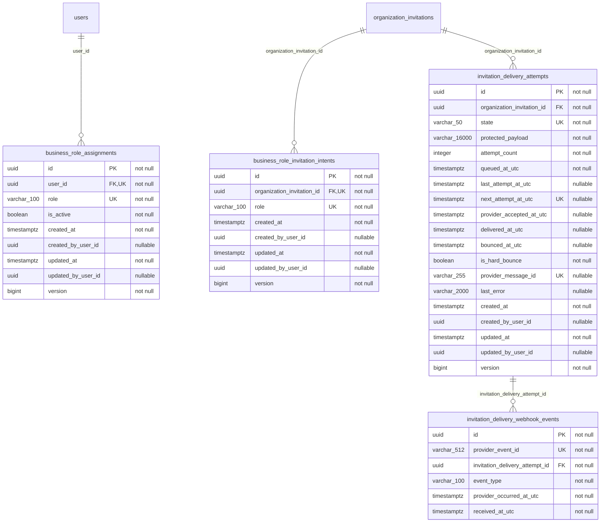
```mermaid
erDiagram
    business_role_assignments {
        uuid id PK "not null"
        uuid user_id FK,UK "not null"
        varchar_100 role UK "not null"
        boolean is_active "not null"
        timestamptz created_at "not null"
        uuid created_by_user_id "nullable"
        timestamptz updated_at "not null"
        uuid updated_by_user_id "nullable"
        bigint version "not null"
    }
    business_role_invitation_intents {
        uuid id PK "not null"
        uuid organization_invitation_id FK,UK "not null"
        varchar_100 role UK "not null"
        timestamptz created_at "not null"
        uuid created_by_user_id "nullable"
        timestamptz updated_at "not null"
        uuid updated_by_user_id "nullable"
        bigint version "not null"
    }
    invitation_delivery_attempts {
        uuid id PK "not null"
        uuid organization_invitation_id FK "not null"
        varchar_50 state UK "not null"
        varchar_16000 protected_payload "not null"
        integer attempt_count "not null"
        timestamptz queued_at_utc "not null"
        timestamptz last_attempt_at_utc "nullable"
        timestamptz next_attempt_at_utc UK "nullable"
        timestamptz provider_accepted_at_utc "nullable"
        timestamptz delivered_at_utc "nullable"
        timestamptz bounced_at_utc "nullable"
        boolean is_hard_bounce "not null"
        varchar_255 provider_message_id UK "nullable"
        varchar_2000 last_error "nullable"
        timestamptz created_at "not null"
        uuid created_by_user_id "nullable"
        timestamptz updated_at "not null"
        uuid updated_by_user_id "nullable"
        bigint version "not null"
    }
    invitation_delivery_webhook_events {
        uuid id PK "not null"
        varchar_512 provider_event_id UK "not null"
        uuid invitation_delivery_attempt_id FK "not null"
        varchar_100 event_type "not null"
        timestamptz provider_occurred_at_utc "not null"
        timestamptz received_at_utc "not null"
    }
    users ||--o{ business_role_assignments : "user_id"
    organization_invitations ||--o{ business_role_invitation_intents : "organization_invitation_id"
    organization_invitations ||--o{ invitation_delivery_attempts : "organization_invitation_id"
    invitation_delivery_attempts ||--o{ invitation_delivery_webhook_events : "invitation_delivery_attempt_id"
```

### Relationships and catalog

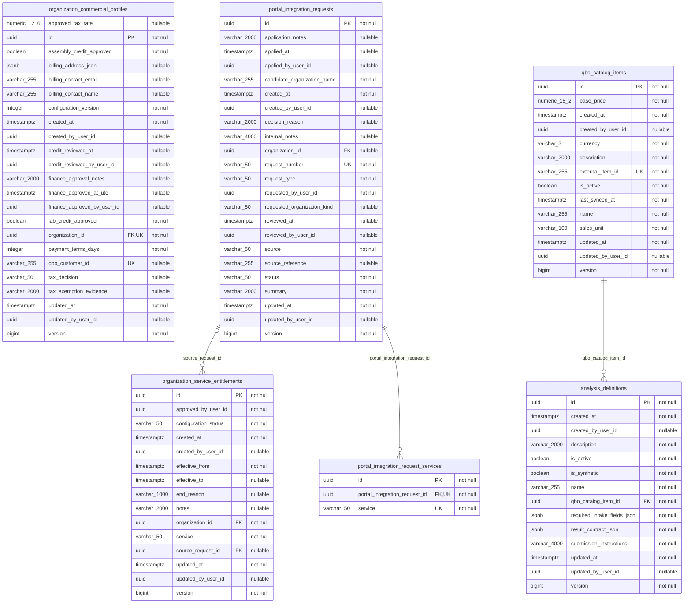
```mermaid
erDiagram
    analysis_definitions {
        uuid id PK "not null"
        timestamptz created_at "not null"
        uuid created_by_user_id "nullable"
        varchar_2000 description "not null"
        boolean is_active "not null"
        boolean is_synthetic "not null"
        varchar_255 name "not null"
        uuid qbo_catalog_item_id FK "not null"
        jsonb required_intake_fields_json "not null"
        jsonb result_contract_json "not null"
        varchar_4000 submission_instructions "not null"
        timestamptz updated_at "not null"
        uuid updated_by_user_id "nullable"
        bigint version "not null"
    }
    organization_commercial_profiles {
        numeric_12_6 approved_tax_rate "nullable"
        uuid id PK "not null"
        boolean assembly_credit_approved "not null"
        jsonb billing_address_json "nullable"
        varchar_255 billing_contact_email "nullable"
        varchar_255 billing_contact_name "nullable"
        integer configuration_version "not null"
        timestamptz created_at "not null"
        uuid created_by_user_id "nullable"
        timestamptz credit_reviewed_at "nullable"
        uuid credit_reviewed_by_user_id "nullable"
        varchar_2000 finance_approval_notes "nullable"
        timestamptz finance_approved_at_utc "nullable"
        uuid finance_approved_by_user_id "nullable"
        boolean lab_credit_approved "not null"
        uuid organization_id FK,UK "not null"
        integer payment_terms_days "not null"
        varchar_255 qbo_customer_id UK "nullable"
        varchar_50 tax_decision "nullable"
        varchar_2000 tax_exemption_evidence "nullable"
        timestamptz updated_at "not null"
        uuid updated_by_user_id "nullable"
        bigint version "not null"
    }
    organization_service_entitlements {
        uuid id PK "not null"
        uuid approved_by_user_id "not null"
        varchar_50 configuration_status "not null"
        timestamptz created_at "not null"
        uuid created_by_user_id "nullable"
        timestamptz effective_from "not null"
        timestamptz effective_to "nullable"
        varchar_1000 end_reason "nullable"
        varchar_2000 notes "nullable"
        uuid organization_id FK "not null"
        varchar_50 service "not null"
        uuid source_request_id FK "nullable"
        timestamptz updated_at "not null"
        uuid updated_by_user_id "nullable"
        bigint version "not null"
    }
    portal_integration_request_services {
        uuid id PK "not null"
        uuid portal_integration_request_id FK,UK "not null"
        varchar_50 service UK "not null"
    }
    portal_integration_requests {
        uuid id PK "not null"
        varchar_2000 application_notes "nullable"
        timestamptz applied_at "nullable"
        uuid applied_by_user_id "nullable"
        varchar_255 candidate_organization_name "not null"
        timestamptz created_at "not null"
        uuid created_by_user_id "nullable"
        varchar_2000 decision_reason "nullable"
        varchar_4000 internal_notes "nullable"
        uuid organization_id FK "nullable"
        varchar_50 request_number UK "not null"
        varchar_50 request_type "not null"
        uuid requested_by_user_id "not null"
        varchar_50 requested_organization_kind "nullable"
        timestamptz reviewed_at "nullable"
        uuid reviewed_by_user_id "nullable"
        varchar_50 source "not null"
        varchar_255 source_reference "nullable"
        varchar_50 status "not null"
        varchar_2000 summary "not null"
        timestamptz updated_at "not null"
        uuid updated_by_user_id "nullable"
        bigint version "not null"
    }
    qbo_catalog_items {
        uuid id PK "not null"
        numeric_18_2 base_price "not null"
        timestamptz created_at "not null"
        uuid created_by_user_id "nullable"
        varchar_3 currency "not null"
        varchar_2000 description "not null"
        varchar_255 external_item_id UK "not null"
        boolean is_active "not null"
        timestamptz last_synced_at "not null"
        varchar_255 name "not null"
        varchar_100 sales_unit "not null"
        timestamptz updated_at "not null"
        uuid updated_by_user_id "nullable"
        bigint version "not null"
    }
    qbo_catalog_items ||--o{ analysis_definitions : "qbo_catalog_item_id"
    portal_integration_requests o|--o{ organization_service_entitlements : "source_request_id"
    portal_integration_requests ||--o{ portal_integration_request_services : "portal_integration_request_id"
```

### Data governance and provisioning

```mermaid
erDiagram
    curated_dataset_version_files {
        uuid id PK "not null"
        varchar_255 content_type "not null"
        uuid curated_dataset_version_id FK,UK "not null"
        varchar_100 file_kind "not null"
        varchar_512 file_name "not null"
        uuid managed_file_id FK,UK "not null"
        varchar_64 sha256 "not null"
        bigint size_bytes "not null"
    }
    curated_dataset_versions {
        uuid id PK "not null"
        varchar_4000 analysis_summary "not null"
        varchar_2000 assay_context "not null"
        varchar_2000 biological_context "not null"
        varchar_64 content_checksum "not null"
        timestamptz created_at "not null"
        uuid created_by_user_id "nullable"
        uuid curated_dataset_id FK,UK "not null"
        timestamptz deidentification_confirmed_at "not null"
        uuid deidentification_confirmed_by_user_id "not null"
        varchar_1000 deidentification_method "not null"
        varchar_2000 deidentification_notes "nullable"
        varchar_2000 description "not null"
        boolean is_synthetic "not null"
        jsonb manifest_json "not null"
        varchar_2000 ownership_basis "not null"
        timestamptz ownership_confirmed_at "not null"
        uuid ownership_confirmed_by_user_id "not null"
        varchar_1000 ownership_evidence_reference "nullable"
        varchar_2000 provenance "not null"
        timestamptz published_at "nullable"
        uuid published_by_user_id "nullable"
        varchar_500 qc_status "not null"
        varchar_4000 release_notes "not null"
        varchar_255 sample_label "not null"
        integer source_revision "not null"
        uuid source_sample_id FK "not null"
        timestamptz source_snapshot_at "not null"
        varchar_50 status "not null"
        timestamptz updated_at "not null"
        uuid updated_by_user_id "nullable"
        bigint version "not null"
        integer version_number UK "not null"
    }
    curated_datasets {
        uuid id PK "not null"
        timestamptz created_at "not null"
        uuid created_by_user_id "nullable"
        varchar_2000 description "not null"
        timestamptz eligibility_approved_at "nullable"
        uuid eligibility_approved_by_user_id "nullable"
        uuid eligible_version_id "nullable"
        boolean is_active "not null"
        varchar_255 name UK "not null"
        timestamptz updated_at "not null"
        uuid updated_by_user_id "nullable"
        bigint version "not null"
    }
    data_governance_affected_organizations {
        uuid id PK "not null"
        integer affected_grant_count "not null"
        varchar_4000 attestation_notes "nullable"
        varchar_50 attestation_source "nullable"
        timestamptz attested_at "nullable"
        uuid attested_by_user_id "nullable"
        timestamptz created_at "not null"
        uuid created_by_user_id "nullable"
        varchar_1000 evidence_source "nullable"
        uuid incident_id FK,UK "not null"
        timestamptz last_reminded_at "nullable"
        varchar_500 organization_contact "nullable"
        uuid organization_id FK,UK "not null"
        integer reminder_count "not null"
        varchar_50 status "not null"
        timestamptz updated_at "not null"
        uuid updated_by_user_id "nullable"
        bigint version "not null"
    }
    data_governance_affected_versions {
        uuid id PK "not null"
        uuid curated_dataset_version_id FK,UK "not null"
        uuid incident_id FK,UK "not null"
        varchar_50 prior_status "not null"
    }
    data_governance_follow_ups {
        uuid id PK "not null"
        uuid actor_user_id FK "not null"
        uuid incident_id FK "not null"
        varchar_50 kind "not null"
        varchar_4000 notes "not null"
        timestamptz occurred_at "not null"
        uuid organization_id FK "nullable"
    }
    data_governance_incidents {
        uuid id PK "not null"
        timestamptz attestation_due_at "not null"
        varchar_50 category "not null"
        timestamptz created_at "not null"
        uuid created_by_user_id "nullable"
        varchar_4000 external_guidance "not null"
        varchar_4000 internal_notes "not null"
        varchar_2000 reason "not null"
        varchar_4000 resolution "nullable"
        timestamptz resolved_at "nullable"
        uuid resolved_by_user_id "nullable"
        uuid source_sample_id FK "not null"
        varchar_50 status "not null"
        timestamptz updated_at "not null"
        uuid updated_by_user_id "nullable"
        bigint version "not null"
    }
    data_provisioning_notices {
        uuid id PK "not null"
        integer attempt_count "not null"
        varchar_4000 body "not null"
        timestamptz created_at "not null"
        timestamptz delivered_at "nullable"
        uuid incident_id FK "nullable"
        varchar_50 kind "not null"
        varchar_2000 last_error "nullable"
        timestamptz next_attempt_at "nullable"
        uuid organization_dataset_grant_id FK "nullable"
        uuid organization_id FK "not null"
        varchar_50 status "not null"
        varchar_500 subject "not null"
    }
    dataset_download_audits {
        uuid id PK "not null"
        uuid curated_dataset_version_id FK "not null"
        timestamptz downloaded_at "not null"
        varchar_50 kind "not null"
        uuid managed_file_id FK "nullable"
        uuid organization_dataset_grant_id FK "not null"
        uuid organization_id FK "not null"
        varchar_100 remote_address "nullable"
        varchar_255 request_id "nullable"
        uuid user_id FK "not null"
    }
    managed_files {
        uuid id PK "not null"
        varchar_255 content_type "not null"
        timestamptz created_at "not null"
        uuid created_by_user_id "nullable"
        varchar_100 file_kind "not null"
        varchar_512 file_name "not null"
        varchar_2000 scan_message "nullable"
        varchar_50 scan_status "not null"
        varchar_64 sha256 "not null"
        bigint size_bytes "not null"
        uuid source_sample_id FK "not null"
        varchar_1000 storage_key UK "not null"
        timestamptz updated_at "not null"
        uuid updated_by_user_id "nullable"
        bigint version "not null"
    }
    organization_dataset_grants {
        uuid id PK "not null"
        timestamptz created_at "not null"
        uuid created_by_user_id "nullable"
        uuid curated_dataset_id FK,UK "not null"
        uuid curated_dataset_version_id FK "not null"
        timestamptz granted_at "not null"
        uuid granted_by_user_id "not null"
        uuid organization_id FK,UK "not null"
        varchar_2000 revocation_reason "nullable"
        timestamptz revoked_at "nullable"
        uuid revoked_by_user_id "nullable"
        varchar_50 status "not null"
        timestamptz superseded_at "nullable"
        uuid superseded_by_user_id "nullable"
        timestamptz updated_at "not null"
        uuid updated_by_user_id "nullable"
        bigint version "not null"
    }
    provisioning_runs {
        uuid id PK "not null"
        timestamptz completed_at "nullable"
        timestamptz created_at "not null"
        uuid created_by_user_id "nullable"
        uuid curated_dataset_version_id FK "not null"
        varchar_100 failure_code "nullable"
        varchar_2000 failure_message "nullable"
        varchar_255 idempotency_key UK "not null"
        varchar_50 kind "not null"
        uuid organization_dataset_grant_id FK "nullable"
        uuid organization_id FK,UK "not null"
        uuid previous_organization_dataset_grant_id FK "nullable"
        timestamptz requested_at "not null"
        uuid requested_by_user_id "not null"
        varchar_50 status "not null"
        timestamptz updated_at "not null"
        uuid updated_by_user_id "nullable"
        bigint version "not null"
    }
    source_samples {
        uuid id PK "not null"
        varchar_4000 analysis_summary "nullable"
        timestamptz archived_at "nullable"
        uuid archived_by_user_id "nullable"
        varchar_2000 assay_context "nullable"
        varchar_2000 biological_context "nullable"
        timestamptz created_at "not null"
        uuid created_by_user_id "nullable"
        timestamptz deidentification_confirmed_at "nullable"
        uuid deidentification_confirmed_by_user_id "nullable"
        varchar_1000 deidentification_method "nullable"
        varchar_2000 deidentification_notes "nullable"
        varchar_2000 description "nullable"
        boolean is_synthetic "not null"
        varchar_255 label UK "not null"
        varchar_2000 ownership_basis "nullable"
        timestamptz ownership_confirmed_at "nullable"
        uuid ownership_confirmed_by_user_id "nullable"
        varchar_1000 ownership_evidence_reference "nullable"
        varchar_2000 provenance "nullable"
        varchar_500 qc_status "nullable"
        timestamptz ready_at "nullable"
        uuid ready_by_user_id "nullable"
        integer revision "not null"
        varchar_50 status "not null"
        timestamptz updated_at "not null"
        uuid updated_by_user_id "nullable"
        bigint version "not null"
    }
    curated_dataset_versions ||--o{ curated_dataset_version_files : "curated_dataset_version_id"
    managed_files ||--o{ curated_dataset_version_files : "managed_file_id"
    curated_datasets ||--o{ curated_dataset_versions : "curated_dataset_id"
    source_samples ||--o{ curated_dataset_versions : "source_sample_id"
    data_governance_incidents ||--o{ data_governance_affected_organizations : "incident_id"
    curated_dataset_versions ||--o{ data_governance_affected_versions : "curated_dataset_version_id"
    data_governance_incidents ||--o{ data_governance_affected_versions : "incident_id"
    data_governance_incidents ||--o{ data_governance_follow_ups : "incident_id"
    source_samples ||--o{ data_governance_incidents : "source_sample_id"
    data_governance_incidents o|--o{ data_provisioning_notices : "incident_id"
    organization_dataset_grants o|--o{ data_provisioning_notices : "organization_dataset_grant_id"
    curated_dataset_versions ||--o{ dataset_download_audits : "curated_dataset_version_id"
    managed_files o|--o{ dataset_download_audits : "managed_file_id"
    organization_dataset_grants ||--o{ dataset_download_audits : "organization_dataset_grant_id"
    source_samples ||--o{ managed_files : "source_sample_id"
    curated_dataset_versions ||--o{ organization_dataset_grants : "curated_dataset_version_id"
    curated_datasets ||--o{ organization_dataset_grants : "curated_dataset_id"
    curated_dataset_versions ||--o{ provisioning_runs : "curated_dataset_version_id"
    organization_dataset_grants o|--o{ provisioning_runs : "organization_dataset_grant_id"
    organization_dataset_grants o|--o{ provisioning_runs : "previous_organization_dataset_grant_id"
```

### Order infrastructure

```mermaid
erDiagram
    commercial_document_links {
        uuid id PK "not null"
        numeric_18_2 balance "not null"
        timestamptz created_at "not null"
        uuid created_by_user_id "nullable"
        varchar_3 currency "not null"
        varchar_255 document_number "nullable"
        varchar_2000 document_url "nullable"
        varchar_255 external_document_id "nullable"
        varchar_100 kind "not null"
        varchar_2000 last_error "nullable"
        varchar_100 sync_status "not null"
        timestamptz synchronized_at "nullable"
        numeric_18_2 total "not null"
        timestamptz updated_at "not null"
        uuid updated_by_user_id "nullable"
        bigint version "not null"
        uuid workflow_id "not null"
        varchar_100 workflow_type "not null"
    }
    managed_operational_files {
        uuid id PK "not null"
        varchar_255 content_type "not null"
        timestamptz created_at "not null"
        uuid created_by_user_id "nullable"
        varchar_100 file_kind "not null"
        varchar_512 file_name "not null"
        uuid organization_id FK "not null"
        uuid parent_record_id "nullable"
        varchar_100 purpose "not null"
        varchar_100 release_status "not null"
        timestamptz released_at "nullable"
        varchar_2000 scan_message "nullable"
        varchar_100 scan_status "not null"
        varchar_64 sha256 "not null"
        bigint size_bytes "not null"
        varchar_1000 storage_key UK "not null"
        timestamptz updated_at "not null"
        uuid updated_by_user_id "nullable"
        bigint version "not null"
        uuid workflow_id "not null"
        varchar_100 workflow_type "not null"
    }
    operational_file_downloads {
        uuid id PK "not null"
        timestamptz completed_at_utc "nullable"
        boolean counts_for_released_package_retention "not null"
        timestamptz lease_expires_at_utc "not null"
        uuid managed_operational_file_id FK "not null"
        uuid organization_id FK "not null"
        varchar_100 outcome "not null"
        uuid released_package_id "not null"
        varchar_100 released_package_type "not null"
        varchar_100 remote_address "nullable"
        varchar_100 scope "not null"
        timestamptz started_at_utc "not null"
        timestamptz terminal_at_utc "nullable"
        varchar_100 terminal_reason_code "nullable"
        uuid transfer_id "not null"
        varchar_1000 user_agent "nullable"
        uuid user_id FK "not null"
        bigint version "not null"
    }
    order_cancellation_requests {
        uuid id PK "not null"
        timestamptz created_at "not null"
        uuid created_by_user_id "nullable"
        timestamptz decided_at "nullable"
        uuid decided_by_user_id FK "nullable"
        varchar_2000 decision_reason "nullable"
        uuid organization_id FK "not null"
        varchar_2000 reason "not null"
        uuid requested_by_user_id FK "not null"
        jsonb scope_json "not null"
        varchar_100 status "not null"
        timestamptz updated_at "not null"
        uuid updated_by_user_id "nullable"
        bigint version "not null"
        uuid workflow_id "not null"
        varchar_100 workflow_type "not null"
    }
    order_idempotency_records {
        uuid id PK "not null"
        uuid actor_user_id FK,UK "not null"
        timestamptz created_at "not null"
        varchar_255 idempotency_key UK "not null"
        varchar_64 request_hash "not null"
        jsonb response_json "not null"
        varchar_200 scope UK "not null"
        integer status_code "not null"
    }
    order_notifications {
        uuid id PK "not null"
        integer attempt_count "not null"
        varchar_4000 body "not null"
        timestamptz created_at "not null"
        uuid created_by_user_id "nullable"
        varchar_100 event_type "not null"
        varchar_2000 last_error "nullable"
        timestamptz next_attempt_at "not null"
        uuid organization_id FK "not null"
        uuid recipient_user_id FK "nullable"
        timestamptz sent_at "nullable"
        varchar_100 status "not null"
        varchar_500 subject "not null"
        timestamptz updated_at "not null"
        uuid updated_by_user_id "nullable"
        bigint version "not null"
        uuid workflow_id "not null"
        varchar_100 workflow_type "not null"
    }
    order_outbox_messages {
        uuid id PK "not null"
        integer attempt_count "not null"
        timestamptz completed_at "nullable"
        timestamptz created_at "not null"
        uuid created_by_user_id "nullable"
        varchar_255 idempotency_key UK "not null"
        varchar_2000 last_error "nullable"
        timestamptz next_attempt_at "not null"
        varchar_100 operation UK "not null"
        jsonb payload_json "not null"
        varchar_100 status "not null"
        timestamptz updated_at "not null"
        uuid updated_by_user_id "nullable"
        bigint version "not null"
        uuid workflow_id UK "not null"
        varchar_100 workflow_type UK "not null"
    }
    order_status_events {
        uuid id PK "not null"
        uuid actor_user_id FK "not null"
        uuid child_record_id "nullable"
        varchar_100 from_status "not null"
        varchar_4000 internal_note "nullable"
        timestamptz occurred_at "not null"
        uuid organization_id FK "not null"
        varchar_2000 tenant_safe_reason "nullable"
        varchar_100 to_status "not null"
        uuid workflow_id "not null"
        varchar_100 workflow_type "not null"
    }
    order_system_configurations {
        uuid id PK "not null"
        timestamptz created_at "not null"
        uuid created_by_user_id "nullable"
        integer quote_validity_days "not null"
        jsonb result_destination_configuration_json "not null"
        jsonb sample_configuration_json "not null"
        varchar_8000 sample_submission_instructions "not null"
        jsonb shipping_configuration_json "not null"
        timestamptz updated_at "not null"
        uuid updated_by_user_id "nullable"
        bigint version "not null"
    }
    managed_operational_files ||--o{ operational_file_downloads : "managed_operational_file_id"
```

### Sample shipping and pre-receipt intake

```mermaid
erDiagram
    sample_shipping_destinations {
        uuid id PK "not null"
        uuid definition_key UK "not null"
        integer revision UK "not null"
        uuid supersedes_destination_id FK "nullable"
        varchar_50 code UK "not null"
        varchar_255 name "not null"
        varchar_255 recipient_name "not null"
        varchar_255 organization_name "not null"
        varchar_255 address_line1 "not null"
        varchar_255 address_line2 "nullable"
        varchar_150 city "not null"
        varchar_150 state_or_province "not null"
        varchar_50 postal_code "not null"
        varchar_2 country_code "not null"
        varchar_50 receiving_phone "nullable"
        varchar_255 receiving_email "nullable"
        varchar_1000 receiving_hours "not null"
        varchar_100 time_zone_id "not null"
        varchar_2000 closure_instructions "nullable"
        varchar_4000 delivery_instructions "not null"
        varchar_2000 carrier_restrictions "nullable"
        boolean international_shipping_allowed "not null"
        timestamptz effective_from "not null"
        timestamptz effective_to "nullable"
        boolean is_active "not null"
        timestamptz created_at "not null"
        uuid created_by_user_id "nullable"
        timestamptz updated_at "not null"
        uuid updated_by_user_id "nullable"
        bigint version "not null"
    }
    sample_type_definitions {
        uuid id PK "not null"
        uuid definition_key UK "not null"
        integer revision UK "not null"
        uuid supersedes_sample_type_id FK "nullable"
        varchar_50 code UK "not null"
        varchar_255 name "not null"
        varchar_2000 description "not null"
        varchar_255 material_class "not null"
        numeric_18_6 minimum_quantity "nullable"
        numeric_18_6 maximum_quantity "nullable"
        varchar_100 quantity_unit "not null"
        varchar_2000 primary_container_requirements "not null"
        varchar_2000 temperature_requirements "not null"
        varchar_2000 stabilizer_requirements "nullable"
        varchar_4000 packaging_instructions "not null"
        varchar_4000 labeling_instructions "not null"
        varchar_2000 prohibited_identifiers "not null"
        varchar_2000 safety_requirements "not null"
        varchar_2000 carrier_restrictions "nullable"
        integer maximum_transit_hours "nullable"
        timestamptz effective_from "not null"
        timestamptz effective_to "nullable"
        boolean is_active "not null"
        timestamptz created_at "not null"
        uuid created_by_user_id "nullable"
        timestamptz updated_at "not null"
        uuid updated_by_user_id "nullable"
        bigint version "not null"
    }
    sample_shipping_instruction_rules {
        uuid id PK "not null"
        uuid definition_key UK "not null"
        integer revision UK "not null"
        uuid supersedes_instruction_rule_id FK "nullable"
        uuid destination_id FK "not null"
        uuid sample_type_definition_id FK "not null"
        varchar_50 compatibility_group "not null"
        varchar_4000 packing_instructions "not null"
        varchar_4000 temperature_instructions "not null"
        varchar_4000 carrier_instructions "not null"
        varchar_4000 dispatch_instructions "not null"
        varchar_4000 delivery_instructions "not null"
        varchar_4000 required_documents "not null"
        varchar_4000 exception_instructions "not null"
        varchar_4000 international_customs_instructions "nullable"
        boolean requires_separate_shipment "not null"
        timestamptz effective_from "not null"
        timestamptz effective_to "nullable"
        boolean is_active "not null"
        timestamptz created_at "not null"
        uuid created_by_user_id "nullable"
        timestamptz updated_at "not null"
        uuid updated_by_user_id "nullable"
        bigint version "not null"
    }
    sample_shipments {
        uuid id PK "not null"
        varchar_100 shipment_number UK "not null"
        uuid organization_id FK "not null"
        varchar_100 authorization_source UK "not null"
        uuid authorization_source_id UK "not null"
        varchar_100 authorization_reference "not null"
        varchar_255 authorization_name "not null"
        uuid lab_work_order_id "not null"
        uuid destination_id FK "not null"
        varchar_100 status "not null"
        varchar_255 carrier "nullable"
        varchar_255 tracking_number "nullable"
        timestamptz shipped_at "nullable"
        timestamptz delivered_at "nullable"
        timestamptz received_at "nullable"
        timestamptz created_at "not null"
        uuid created_by_user_id "nullable"
        timestamptz updated_at "not null"
        uuid updated_by_user_id "nullable"
        bigint version "not null"
    }
    sample_shipment_items {
        uuid id PK "not null"
        uuid sample_shipment_id FK,UK "not null"
        uuid submitted_specimen_id UK "not null"
        uuid sample_type_definition_id FK "not null"
        varchar_100 customer_sample_id "not null"
        varchar_255 sample_name "not null"
        numeric_18_6 quantity "not null"
        varchar_100 quantity_unit "not null"
        uuid registered_sample_tube_id FK,UK "nullable"
        timestamptz tube_assigned_at "nullable"
        timestamptz created_at "not null"
        uuid created_by_user_id "nullable"
        timestamptz updated_at "not null"
        uuid updated_by_user_id "nullable"
        bigint version "not null"
    }
    sample_shipment_tube_slots {
        uuid id PK "not null"
        uuid sample_shipment_item_id FK,UK "not null"
        integer ordinal UK "not null"
        uuid registered_sample_tube_id FK,UK "nullable"
        timestamptz tube_assigned_at "nullable"
        timestamptz created_at "not null"
        uuid created_by_user_id "nullable"
        timestamptz updated_at "not null"
        uuid updated_by_user_id "nullable"
        bigint version "not null"
    }
    sample_return_kits {
        uuid id PK "not null"
        varchar_100 kit_number UK "not null"
        uuid sample_shipment_id FK,UK "not null"
        uuid organization_id FK "not null"
        varchar_100 authorization_source UK "not null"
        uuid authorization_source_id UK "not null"
        varchar_255 tube_supplier_name "not null"
        varchar_100 tube_product_number "not null"
        varchar_100 tube_lot_number "nullable"
        varchar_255 shipper_supplier_name "not null"
        varchar_100 shipper_product_number "not null"
        integer required_tube_count "not null"
        varchar_100 status "not null"
        varchar_255 outbound_carrier "nullable"
        varchar_255 outbound_tracking_number "nullable"
        timestamptz fulfilled_at "nullable"
        timestamptz created_at "not null"
        uuid created_by_user_id "nullable"
        timestamptz updated_at "not null"
        uuid updated_by_user_id "nullable"
        bigint version "not null"
    }
    registered_sample_tubes {
        uuid id PK "not null"
        uuid sample_return_kit_id FK "not null"
        varchar_100 supplier_barcode UK "not null"
        varchar_100 status "not null"
        timestamptz assigned_at "nullable"
        timestamptz accessioned_at "nullable"
        timestamptz created_at "not null"
        uuid created_by_user_id "nullable"
        timestamptz updated_at "not null"
        uuid updated_by_user_id "nullable"
        bigint version "not null"
    }
    sample_tube_assignment_events {
        uuid id PK "not null"
        uuid sample_shipment_id FK "not null"
        uuid sample_shipment_item_id FK "not null"
        uuid sample_shipment_tube_slot_id FK "nullable"
        uuid registered_sample_tube_id FK "not null"
        varchar_100 customer_sample_id "not null"
        varchar_100 supplier_barcode "not null"
        varchar_100 action "not null"
        varchar_1000 reason "nullable"
        uuid actor_user_id "not null"
        timestamptz occurred_at "not null"
    }
    sample_shipping_packet_revisions {
        uuid id PK "not null"
        uuid sample_shipment_id FK,UK "not null"
        integer revision UK "not null"
        varchar_100 packet_number UK "not null"
        varchar_20 barcode UK "not null"
        jsonb destination_snapshot_json "not null"
        jsonb instruction_snapshot_json "not null"
        jsonb manifest_snapshot_json "not null"
        timestamptz issued_at "not null"
        timestamptz voided_at "nullable"
        varchar_2000 void_reason "nullable"
        uuid replaced_by_packet_revision_id FK "nullable"
        timestamptz created_at "not null"
        uuid created_by_user_id "nullable"
        timestamptz updated_at "not null"
        uuid updated_by_user_id "nullable"
        bigint version "not null"
    }
    sample_shipping_destinations o|--o{ sample_shipping_destinations : "supersedes_destination_id"
    sample_type_definitions o|--o{ sample_type_definitions : "supersedes_sample_type_id"
    sample_shipping_destinations ||--o{ sample_shipping_instruction_rules : "destination_id"
    sample_type_definitions ||--o{ sample_shipping_instruction_rules : "sample_type_definition_id"
    sample_shipping_instruction_rules o|--o{ sample_shipping_instruction_rules : "supersedes_instruction_rule_id"
    sample_shipping_destinations ||--o{ sample_shipments : "destination_id"
    sample_shipments ||--o{ sample_shipment_items : "sample_shipment_id"
    sample_type_definitions ||--o{ sample_shipment_items : "sample_type_definition_id"
    sample_shipments ||--o| sample_return_kits : "sample_shipment_id"
    organizations ||--o{ sample_return_kits : "organization_id"
    sample_return_kits ||--o{ registered_sample_tubes : "sample_return_kit_id"
    registered_sample_tubes o|--o| sample_shipment_items : "registered_sample_tube_id"
    sample_shipment_items ||--o{ sample_shipment_tube_slots : "sample_shipment_item_id"
    registered_sample_tubes o|--o| sample_shipment_tube_slots : "registered_sample_tube_id"
    sample_shipments ||--o{ sample_tube_assignment_events : "sample_shipment_id"
    sample_shipment_items ||--o{ sample_tube_assignment_events : "sample_shipment_item_id"
    sample_shipment_tube_slots o|--o{ sample_tube_assignment_events : "sample_shipment_tube_slot_id"
    registered_sample_tubes ||--o{ sample_tube_assignment_events : "registered_sample_tube_id"
    sample_shipments ||--o{ sample_shipping_packet_revisions : "sample_shipment_id"
    sample_shipping_packet_revisions o|--o{ sample_shipping_packet_revisions : "replaced_by_packet_revision_id"
```

### Lab service orders

```mermaid
erDiagram
    lab_authorizations {
        uuid id PK "not null"
        uuid authorization_id UK "not null"
        jsonb authorization_snapshot_json "not null"
        integer authorization_version "not null"
        uuid command_id UK "not null"
        uuid commercial_order_id UK "not null"
        timestamptz created_at "not null"
        uuid created_by_user_id "nullable"
        uuid lab_work_order_id "nullable"
        uuid organization_id "not null"
        varchar_100 provider_reason_code "nullable"
        varchar_50 status "not null"
        timestamptz updated_at "not null"
        uuid updated_by_user_id "nullable"
        bigint version "not null"
    }
    lab_operations_event_receipts {
        uuid id PK "not null"
        uuid authorization_id "not null"
        uuid event_id UK "not null"
        timestamptz processed_at_utc "not null"
        bigint projection_version "not null"
    }
    lab_result_releases {
        uuid id PK "not null"
        varchar_255 analysis_profile "not null"
        timestamptz created_at "not null"
        uuid created_by_user_id "nullable"
        timestamptz generated_at "not null"
        uuid lab_sample_id FK,UK "not null"
        uuid lab_service_order_id FK "not null"
        jsonb manifest_json "not null"
        uuid organization_id FK "not null"
        varchar_255 pipeline_version "not null"
        varchar_4000 provenance "not null"
        varchar_500 qc_status "not null"
        varchar_100 release_status "not null"
        integer release_version UK "not null"
        timestamptz released_at "nullable"
        timestamptz updated_at "not null"
        uuid updated_by_user_id "nullable"
        bigint version "not null"
    }
    lab_samples {
        uuid id PK "not null"
        varchar_100 accession_id UK "nullable"
        jsonb analysis_definition_ids_json "not null"
        varchar_500 biological_source "not null"
        varchar_255 carrier "nullable"
        timestamptz collection_date "nullable"
        numeric_18_6 concentration "nullable"
        timestamptz created_at "not null"
        uuid created_by_user_id "nullable"
        varchar_255 customer_sample_id UK "not null"
        timestamptz customer_shipped_at "nullable"
        varchar_4000 internal_note "nullable"
        uuid lab_service_order_id FK,UK "not null"
        varchar_255 material_type "not null"
        varchar_4000 notes "nullable"
        numeric_18_6 quantity "not null"
        varchar_100 quantity_unit "not null"
        varchar_1000 receipt_condition "nullable"
        timestamptz received_at "nullable"
        uuid replacement_for_sample_id FK "nullable"
        varchar_100 resume_status "nullable"
        varchar_2000 safety_declaration "not null"
        varchar_100 status "not null"
        varchar_2000 storage_requirements "not null"
        varchar_2000 tenant_safe_reason "nullable"
        varchar_255 tracking_number "nullable"
        timestamptz updated_at "not null"
        uuid updated_by_user_id "nullable"
        bigint version "not null"
    }
    lab_service_orders {
        uuid id PK "not null"
        uuid accepted_quote_id "nullable"
        uuid assigned_to_user_id FK "nullable"
        timestamptz completed_at "nullable"
        timestamptz created_at "not null"
        uuid created_by_user_id "nullable"
        uuid current_quote_id "nullable"
        varchar_255 customer_reference "not null"
        varchar_2000 description "nullable"
        timestamptz due_at "nullable"
        boolean has_mixed_biological_sources "not null"
        varchar_4000 internal_note "nullable"
        boolean is_discarded "not null"
        varchar_50 order_number UK "not null"
        varchar_255 normalized_job_name UK "not null"
        uuid organization_id FK,UK "not null"
        timestamptz placed_at "nullable"
        jsonb placement_snapshot_json "nullable"
        varchar_1000 price_proposal_note "nullable"
        timestamptz price_proposed_at "nullable"
        uuid price_proposed_by_user_id FK "nullable"
        numeric_18_2 proposed_unit_price "nullable"
        integer requested_specimen_count "not null"
        integer request_revision "not null"
        varchar_100 resume_status "nullable"
        varchar_2000 safety_declaration "not null"
        varchar_500 shared_biological_source "nullable"
        timestamptz sample_roster_finalized_at "nullable"
        uuid sample_roster_finalized_by_user_id FK "nullable"
        uuid source_request_id FK,UK "nullable"
        varchar_100 status "not null"
        varchar_2000 storage_requirements "not null"
        varchar_8000 submission_instructions_snapshot "not null"
        timestamptz submitted_at "nullable"
        uuid submitted_by_user_id "nullable"
        varchar_2000 tenant_safe_reason "nullable"
        timestamptz updated_at "not null"
        uuid updated_by_user_id "nullable"
        bigint version "not null"
    }
    lab_service_source_groups {
        uuid id PK "not null"
        uuid lab_service_order_id FK,UK "not null"
        varchar_500 biological_source "not null"
        varchar_500 normalized_biological_source UK "not null"
        integer specimen_count "not null"
        timestamptz created_at "not null"
        uuid created_by_user_id "nullable"
        timestamptz updated_at "not null"
        uuid updated_by_user_id "nullable"
        bigint version "not null"
    }
    lab_sample_import_previews {
        uuid id PK "not null"
        uuid lab_service_order_id FK "not null"
        uuid organization_id FK "not null"
        uuid actor_user_id FK "not null"
        varchar_64 file_sha256 "not null"
        jsonb rows_json "not null"
        jsonb errors_json "not null"
        integer valid_row_count "not null"
        integer blank_row_count "not null"
        timestamptz expires_at "not null"
        timestamptz confirmed_at "nullable"
        timestamptz created_at "not null"
        uuid created_by_user_id "nullable"
        timestamptz updated_at "not null"
        uuid updated_by_user_id "nullable"
        bigint version "not null"
    }
    lab_service_quotes {
        uuid id PK "not null"
        timestamptz accepted_at "nullable"
        uuid accepted_by_user_id "nullable"
        jsonb billing_address_snapshot_json "nullable"
        jsonb billing_contact_snapshot_json "nullable"
        integer commercial_configuration_version "nullable"
        timestamptz created_at "not null"
        uuid created_by_user_id "nullable"
        varchar_3 currency "not null"
        timestamptz expires_at "not null"
        timestamptz issued_at "not null"
        uuid lab_service_order_id FK,UK "not null"
        jsonb lines_json "not null"
        integer payment_terms_days_snapshot "nullable"
        timestamptz pricing_decided_at "nullable"
        uuid pricing_decided_by_user_id FK "nullable"
        varchar_100 pricing_decision "nullable"
        varchar_2000 pricing_decision_reason "nullable"
        numeric_18_2 proposed_unit_price_snapshot "nullable"
        varchar_100 purpose "not null"
        integer revision UK "not null"
        varchar_100 status "not null"
        numeric_18_2 subtotal "not null"
        integer source_request_revision "nullable"
        uuid superseded_by_quote_id FK "nullable"
        numeric_18_2 tax "not null"
        jsonb tax_decision_snapshot_json "nullable"
        numeric_18_2 total "not null"
        timestamptz updated_at "not null"
        uuid updated_by_user_id "nullable"
        bigint version "not null"
    }
    lab_service_request_revisions {
        uuid id PK "not null"
        varchar_2000 correction_reason "nullable"
        uuid lab_service_order_id FK,UK "not null"
        uuid previous_revision_id FK "nullable"
        integer revision UK "not null"
        jsonb snapshot_json "not null"
        timestamptz submitted_at "not null"
        uuid submitted_by_user_id FK "not null"
    }
    lab_work_projections {
        uuid id PK "not null"
        integer active_customer_action_count "not null"
        uuid authorization_id UK "not null"
        integer authorization_version "not null"
        varchar_2000 customer_safe_summary "nullable"
        timestamptz expected_completion_at_utc "nullable"
        uuid lab_work_order_id UK "not null"
        timestamptz last_changed_at_utc "not null"
        varchar_50 milestone "not null"
        jsonb permitted_qc_projection_json "nullable"
        bigint projection_version "not null"
        varchar_50 schedule_health "not null"
    }
    lab_samples ||--o{ lab_result_releases : "lab_sample_id"
    lab_service_orders ||--o{ lab_result_releases : "lab_service_order_id"
    lab_samples o|--o{ lab_samples : "replacement_for_sample_id"
    lab_service_orders ||--o{ lab_samples : "lab_service_order_id"
    lab_service_orders ||--o{ lab_service_source_groups : "lab_service_order_id"
    lab_service_orders ||--o{ lab_sample_import_previews : "lab_service_order_id"
    lab_service_orders ||--o{ lab_service_quotes : "lab_service_order_id"
    lab_service_quotes o|--o{ lab_service_quotes : "superseded_by_quote_id"
    lab_service_orders ||--o{ lab_service_request_revisions : "lab_service_order_id"
    portal_integration_requests o|--o| lab_service_orders : "source_request_id"
    lab_service_request_revisions o|--o{ lab_service_request_revisions : "previous_revision_id"
```

### PSeq accounts receivable and operational attention

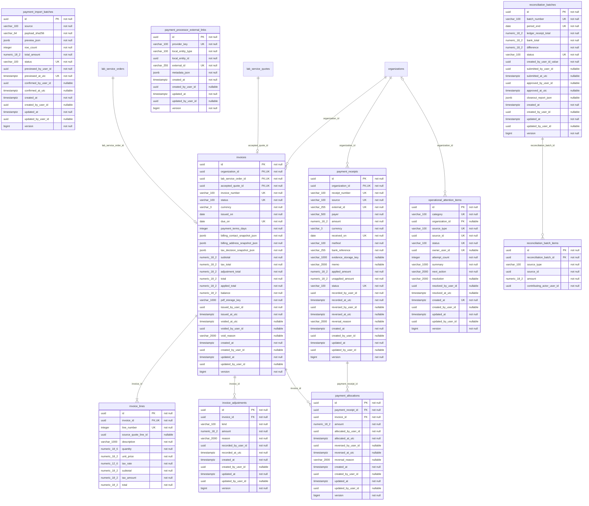
```mermaid
erDiagram
    invoices {
        uuid id PK "not null"
        uuid organization_id FK,UK "not null"
        uuid lab_service_order_id FK,UK "not null"
        uuid accepted_quote_id FK,UK "not null"
        varchar_100 invoice_number UK "not null"
        varchar_100 status UK "not null"
        varchar_3 currency "not null"
        date issued_on "not null"
        date due_on UK "not null"
        integer payment_terms_days "not null"
        jsonb billing_contact_snapshot_json "not null"
        jsonb billing_address_snapshot_json "not null"
        jsonb tax_decision_snapshot_json "not null"
        numeric_18_2 subtotal "not null"
        numeric_18_2 tax_total "not null"
        numeric_18_2 adjustment_total "not null"
        numeric_18_2 total "not null"
        numeric_18_2 applied_total "not null"
        numeric_18_2 balance "not null"
        varchar_1000 pdf_storage_key "not null"
        uuid issued_by_user_id "not null"
        timestamptz issued_at_utc "not null"
        timestamptz voided_at_utc "nullable"
        uuid voided_by_user_id "nullable"
        varchar_2000 void_reason "nullable"
        timestamptz created_at "not null"
        uuid created_by_user_id "nullable"
        timestamptz updated_at "not null"
        uuid updated_by_user_id "nullable"
        bigint version "not null"
    }
    invoice_lines {
        uuid id PK "not null"
        uuid invoice_id FK,UK "not null"
        integer line_number UK "not null"
        uuid source_quote_line_id "nullable"
        varchar_1000 description "not null"
        numeric_18_6 quantity "not null"
        numeric_18_2 unit_price "not null"
        numeric_12_6 tax_rate "not null"
        numeric_18_2 subtotal "not null"
        numeric_18_2 tax_amount "not null"
        numeric_18_2 total "not null"
    }
    invoice_adjustments {
        uuid id PK "not null"
        uuid invoice_id FK "not null"
        varchar_100 kind "not null"
        numeric_18_2 amount "not null"
        varchar_2000 reason "not null"
        uuid recorded_by_user_id "not null"
        timestamptz recorded_at_utc "not null"
        timestamptz created_at "not null"
        uuid created_by_user_id "nullable"
        timestamptz updated_at "not null"
        uuid updated_by_user_id "nullable"
        bigint version "not null"
    }
    payment_receipts {
        uuid id PK "not null"
        uuid organization_id FK,UK "not null"
        varchar_100 receipt_number UK "not null"
        varchar_100 source UK "not null"
        varchar_255 external_id UK "not null"
        varchar_500 payer "not null"
        numeric_18_2 amount "not null"
        varchar_3 currency "not null"
        date received_on UK "not null"
        varchar_100 method "not null"
        varchar_255 bank_reference "not null"
        varchar_1000 evidence_storage_key "nullable"
        varchar_2000 memo "nullable"
        numeric_18_2 applied_amount "not null"
        numeric_18_2 unapplied_amount "not null"
        varchar_100 status UK "not null"
        uuid recorded_by_user_id "not null"
        timestamptz recorded_at_utc "not null"
        uuid reversed_by_user_id "nullable"
        timestamptz reversed_at_utc "nullable"
        varchar_2000 reversal_reason "nullable"
        timestamptz created_at "not null"
        uuid created_by_user_id "nullable"
        timestamptz updated_at "not null"
        uuid updated_by_user_id "nullable"
        bigint version "not null"
    }
    payment_allocations {
        uuid id PK "not null"
        uuid payment_receipt_id FK "not null"
        uuid invoice_id FK "not null"
        numeric_18_2 amount "not null"
        uuid allocated_by_user_id "not null"
        timestamptz allocated_at_utc "not null"
        uuid reversed_by_user_id "nullable"
        timestamptz reversed_at_utc "nullable"
        varchar_2000 reversal_reason "nullable"
        timestamptz created_at "not null"
        uuid created_by_user_id "nullable"
        timestamptz updated_at "not null"
        uuid updated_by_user_id "nullable"
        bigint version "not null"
    }
    payment_import_batches {
        uuid id PK "not null"
        varchar_100 source "not null"
        varchar_64 payload_sha256 "not null"
        jsonb preview_json "not null"
        integer row_count "not null"
        numeric_18_2 total_amount "not null"
        varchar_100 status UK "not null"
        uuid previewed_by_user_id "not null"
        timestamptz previewed_at_utc UK "not null"
        uuid confirmed_by_user_id "nullable"
        timestamptz confirmed_at_utc "nullable"
        timestamptz created_at "not null"
        uuid created_by_user_id "nullable"
        timestamptz updated_at "not null"
        uuid updated_by_user_id "nullable"
        bigint version "not null"
    }
    reconciliation_batches {
        uuid id PK "not null"
        varchar_100 batch_number UK "not null"
        date period_end UK "not null"
        numeric_18_2 ledger_receipt_total "not null"
        numeric_18_2 bank_total "not null"
        numeric_18_2 difference "not null"
        varchar_100 status UK "not null"
        uuid created_by_user_id_value "not null"
        uuid submitted_by_user_id "nullable"
        timestamptz submitted_at_utc "nullable"
        uuid approved_by_user_id "nullable"
        timestamptz approved_at_utc "nullable"
        jsonb closeout_report_json "nullable"
        timestamptz created_at "not null"
        uuid created_by_user_id "nullable"
        timestamptz updated_at "not null"
        uuid updated_by_user_id "nullable"
        bigint version "not null"
    }
    reconciliation_batch_items {
        uuid id PK "not null"
        uuid reconciliation_batch_id FK "not null"
        varchar_100 source_type "not null"
        uuid source_id "not null"
        numeric_18_2 amount "not null"
        uuid contributing_actor_user_id "not null"
    }
    payment_processor_external_links {
        uuid id PK "not null"
        varchar_100 provider_key UK "not null"
        varchar_100 local_entity_type "not null"
        uuid local_entity_id "not null"
        varchar_255 external_id UK "not null"
        jsonb metadata_json "not null"
        timestamptz created_at "not null"
        uuid created_by_user_id "nullable"
        timestamptz updated_at "not null"
        uuid updated_by_user_id "nullable"
        bigint version "not null"
    }
    operational_attention_items {
        uuid id PK "not null"
        varchar_100 category UK "not null"
        uuid organization_id FK "nullable"
        varchar_100 source_type UK "not null"
        uuid source_id UK "not null"
        varchar_100 status UK "not null"
        uuid owner_user_id UK "nullable"
        integer attempt_count "not null"
        varchar_1000 summary "not null"
        varchar_2000 next_action "not null"
        varchar_2000 resolution "nullable"
        uuid resolved_by_user_id "nullable"
        timestamptz resolved_at_utc "nullable"
        timestamptz created_at UK "not null"
        uuid created_by_user_id "nullable"
        timestamptz updated_at "not null"
        uuid updated_by_user_id "nullable"
        bigint version "not null"
    }
    organizations ||--o{ invoices : "organization_id"
    lab_service_orders ||--o| invoices : "lab_service_order_id"
    lab_service_quotes ||--o| invoices : "accepted_quote_id"
    invoices ||--|{ invoice_lines : "invoice_id"
    invoices ||--o{ invoice_adjustments : "invoice_id"
    organizations ||--o{ payment_receipts : "organization_id"
    payment_receipts ||--o{ payment_allocations : "payment_receipt_id"
    invoices ||--o{ payment_allocations : "invoice_id"
    reconciliation_batches ||--o{ reconciliation_batch_items : "reconciliation_batch_id"
    organizations o|--o{ operational_attention_items : "organization_id"
```

### Governed PSeq result delivery

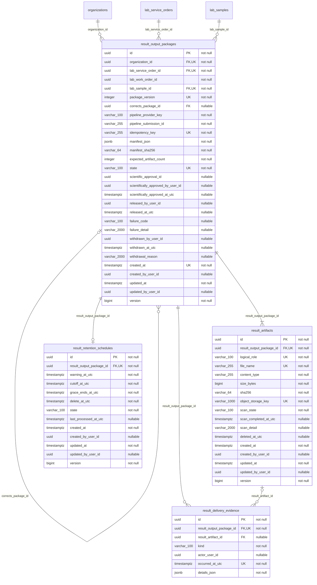
```mermaid
erDiagram
    result_output_packages {
        uuid id PK "not null"
        uuid organization_id FK,UK "not null"
        uuid lab_service_order_id FK,UK "not null"
        uuid lab_work_order_id "not null"
        uuid lab_sample_id FK,UK "not null"
        integer package_version UK "not null"
        uuid corrects_package_id FK "nullable"
        varchar_100 pipeline_provider_key "not null"
        varchar_255 pipeline_submission_id "not null"
        varchar_255 idempotency_key UK "not null"
        jsonb manifest_json "not null"
        varchar_64 manifest_sha256 "not null"
        integer expected_artifact_count "not null"
        varchar_100 state UK "not null"
        uuid scientific_approval_id "nullable"
        uuid scientifically_approved_by_user_id "nullable"
        timestamptz scientifically_approved_at_utc "nullable"
        uuid released_by_user_id "nullable"
        timestamptz released_at_utc "nullable"
        varchar_100 failure_code "nullable"
        varchar_2000 failure_detail "nullable"
        uuid withdrawn_by_user_id "nullable"
        timestamptz withdrawn_at_utc "nullable"
        varchar_2000 withdrawal_reason "nullable"
        timestamptz created_at UK "not null"
        uuid created_by_user_id "nullable"
        timestamptz updated_at "not null"
        uuid updated_by_user_id "nullable"
        bigint version "not null"
    }
    result_artifacts {
        uuid id PK "not null"
        uuid result_output_package_id FK,UK "not null"
        varchar_100 logical_role UK "not null"
        varchar_255 file_name UK "not null"
        varchar_255 content_type "not null"
        bigint size_bytes "not null"
        varchar_64 sha256 "not null"
        varchar_1000 object_storage_key UK "not null"
        varchar_100 scan_state "not null"
        timestamptz scan_completed_at_utc "nullable"
        varchar_2000 scan_detail "nullable"
        timestamptz deleted_at_utc "nullable"
        timestamptz created_at "not null"
        uuid created_by_user_id "nullable"
        timestamptz updated_at "not null"
        uuid updated_by_user_id "nullable"
        bigint version "not null"
    }
    result_retention_schedules {
        uuid id PK "not null"
        uuid result_output_package_id FK,UK "not null"
        timestamptz warning_at_utc "not null"
        timestamptz cutoff_at_utc "not null"
        timestamptz grace_ends_at_utc "not null"
        timestamptz delete_at_utc "not null"
        varchar_100 state "not null"
        timestamptz last_processed_at_utc "nullable"
        timestamptz created_at "not null"
        uuid created_by_user_id "nullable"
        timestamptz updated_at "not null"
        uuid updated_by_user_id "nullable"
        bigint version "not null"
    }
    result_delivery_evidence {
        uuid id PK "not null"
        uuid result_output_package_id FK,UK "not null"
        uuid result_artifact_id FK "nullable"
        varchar_100 kind "not null"
        uuid actor_user_id "nullable"
        timestamptz occurred_at_utc UK "not null"
        jsonb details_json "not null"
    }
    organizations ||--o{ result_output_packages : "organization_id"
    lab_service_orders ||--o{ result_output_packages : "lab_service_order_id"
    lab_samples ||--o{ result_output_packages : "lab_sample_id"
    result_output_packages o|--o{ result_output_packages : "corrects_package_id"
    result_output_packages ||--|{ result_artifacts : "result_output_package_id"
    result_output_packages ||--o| result_retention_schedules : "result_output_package_id"
    result_output_packages ||--o{ result_delivery_evidence : "result_output_package_id"
    result_artifacts o|--o{ result_delivery_evidence : "result_artifact_id"
```

### Data assembly

```mermaid
erDiagram
    assembly_input_revisions {
        uuid id PK "not null"
        varchar_2000 correction_reason "nullable"
        uuid data_assembly_request_id FK,UK "not null"
        jsonb manifest_json "not null"
        uuid previous_revision_id FK "nullable"
        integer revision UK "not null"
        timestamptz submitted_at "not null"
        uuid submitted_by_user_id FK "not null"
        jsonb validation_summary_json "not null"
    }
    assembly_output_releases {
        uuid id PK "not null"
        timestamptz created_at "not null"
        uuid created_by_user_id "nullable"
        uuid data_assembly_request_id FK,UK "not null"
        timestamptz generated_at "not null"
        uuid input_revision_id FK "not null"
        jsonb manifest_json "not null"
        uuid organization_id FK "not null"
        varchar_255 pipeline_version "not null"
        uuid processing_run_id FK "not null"
        varchar_4000 provenance "not null"
        varchar_500 qc_status "not null"
        varchar_100 release_status "not null"
        integer release_version UK "not null"
        timestamptz released_at "nullable"
        timestamptz updated_at "not null"
        uuid updated_by_user_id "nullable"
        bigint version "not null"
    }
    assembly_processing_runs {
        uuid id PK "not null"
        timestamptz completed_at "nullable"
        timestamptz created_at "not null"
        uuid created_by_user_id "nullable"
        uuid data_assembly_request_id FK,UK "not null"
        varchar_2000 failure_reason "nullable"
        uuid input_revision_id FK "not null"
        varchar_255 pipeline_version "not null"
        varchar_255 profile_version "not null"
        varchar_4000 provenance "not null"
        varchar_500 qc_status "nullable"
        integer run_number UK "not null"
        timestamptz started_at "not null"
        timestamptz updated_at "not null"
        uuid updated_by_user_id "nullable"
        bigint version "not null"
    }
    assembly_profiles {
        uuid id PK "not null"
        jsonb allowed_file_kinds_json "not null"
        timestamptz created_at "not null"
        uuid created_by_user_id "nullable"
        varchar_2000 description "not null"
        varchar_4000 instructions "not null"
        boolean is_active "not null"
        boolean is_synthetic "not null"
        bigint maximum_file_size_bytes "not null"
        bigint maximum_total_size_bytes "not null"
        jsonb metadata_schema_json "not null"
        varchar_255 name UK "not null"
        jsonb output_contract_json "not null"
        integer profile_version UK "not null"
        uuid qbo_catalog_item_id FK "not null"
        timestamptz updated_at "not null"
        uuid updated_by_user_id "nullable"
        bigint version "not null"
    }
    data_assembly_quotes {
        uuid id PK "not null"
        timestamptz accepted_at "nullable"
        uuid accepted_by_user_id "nullable"
        timestamptz created_at "not null"
        uuid created_by_user_id "nullable"
        varchar_3 currency "not null"
        uuid data_assembly_request_id FK,UK "not null"
        timestamptz expires_at "not null"
        timestamptz issued_at "not null"
        jsonb lines_json "not null"
        varchar_100 purpose "not null"
        integer revision UK "not null"
        varchar_100 status "not null"
        numeric_18_2 subtotal "not null"
        uuid superseded_by_quote_id FK "nullable"
        numeric_18_2 tax "not null"
        numeric_18_2 total "not null"
        timestamptz updated_at "not null"
        uuid updated_by_user_id "nullable"
        bigint version "not null"
    }
    data_assembly_requests {
        uuid id PK "not null"
        uuid accepted_quote_id "nullable"
        uuid assembly_profile_id FK "not null"
        integer assembly_profile_version "not null"
        uuid assigned_to_user_id FK "nullable"
        timestamptz completed_at "nullable"
        timestamptz created_at "not null"
        uuid created_by_user_id "nullable"
        uuid current_input_revision_id "nullable"
        uuid current_quote_id "nullable"
        timestamptz due_at "nullable"
        integer input_revision "not null"
        varchar_4000 internal_note "nullable"
        boolean is_discarded "not null"
        jsonb metadata_json "not null"
        uuid organization_id FK "not null"
        timestamptz placed_at "nullable"
        varchar_4000 processing_notes "nullable"
        varchar_4000 profile_instructions_snapshot "not null"
        varchar_255 profile_name_snapshot "not null"
        boolean prohibited_data_confirmed "not null"
        varchar_255 project_reference "not null"
        varchar_255 purchase_order_number "nullable"
        varchar_50 request_number UK "not null"
        varchar_2000 requested_output "not null"
        varchar_100 resume_status "nullable"
        varchar_100 status "not null"
        timestamptz submitted_at "nullable"
        varchar_2000 tenant_safe_reason "nullable"
        timestamptz updated_at "not null"
        uuid updated_by_user_id "nullable"
        bigint version "not null"
    }
    assembly_input_revisions o|--o{ assembly_input_revisions : "previous_revision_id"
    data_assembly_requests ||--o{ assembly_input_revisions : "data_assembly_request_id"
    assembly_input_revisions ||--o{ assembly_output_releases : "input_revision_id"
    assembly_processing_runs ||--o{ assembly_output_releases : "processing_run_id"
    data_assembly_requests ||--o{ assembly_output_releases : "data_assembly_request_id"
    assembly_input_revisions ||--o{ assembly_processing_runs : "input_revision_id"
    data_assembly_requests ||--o{ assembly_processing_runs : "data_assembly_request_id"
    data_assembly_quotes o|--o{ data_assembly_quotes : "superseded_by_quote_id"
    data_assembly_requests ||--o{ data_assembly_quotes : "data_assembly_request_id"
    assembly_profiles ||--o{ data_assembly_requests : "assembly_profile_id"
```

### Partner reagent orders

```mermaid
erDiagram
    partner_reagent_offerings {
        uuid id PK "not null"
        timestamptz created_at "not null"
        uuid created_by_user_id "nullable"
        varchar_3 currency "not null"
        timestamptz effective_from "not null"
        timestamptz effective_to "nullable"
        boolean is_active "not null"
        numeric_18_6 maximum_quantity "nullable"
        numeric_18_6 minimum_quantity "nullable"
        numeric_18_2 negotiated_unit_price "not null"
        numeric_18_6 order_increment "not null"
        uuid partner_organization_id FK "not null"
        uuid qbo_catalog_item_id FK "not null"
        varchar_100 selling_unit "not null"
        jsonb shipping_restrictions_json "not null"
        timestamptz updated_at "not null"
        uuid updated_by_user_id "nullable"
        bigint version "not null"
    }
    partner_reagent_order_lines {
        uuid id PK "not null"
        numeric_18_6 cancelled_quantity "not null"
        timestamptz created_at "not null"
        uuid created_by_user_id "nullable"
        varchar_3 currency "not null"
        varchar_1000 description "not null"
        timestamptz estimated_ship_date "nullable"
        varchar_255 external_item_id "not null"
        numeric_18_2 line_total "not null"
        varchar_2000 note "nullable"
        uuid offering_id FK "not null"
        uuid partner_reagent_order_id FK "not null"
        uuid qbo_catalog_item_id FK "not null"
        numeric_18_6 quantity "not null"
        numeric_18_6 shipped_quantity "not null"
        varchar_100 unit "not null"
        numeric_18_2 unit_price "not null"
        timestamptz updated_at "not null"
        uuid updated_by_user_id "nullable"
        bigint version "not null"
    }
    partner_reagent_orders {
        uuid id PK "not null"
        timestamptz accepted_at "nullable"
        uuid assigned_to_user_id FK "nullable"
        timestamptz created_at "not null"
        uuid created_by_user_id "nullable"
        timestamptz due_at "nullable"
        timestamptz fulfilled_at "nullable"
        varchar_4000 internal_note "nullable"
        boolean is_discarded "not null"
        varchar_50 order_number UK "not null"
        uuid organization_id FK "not null"
        timestamptz placed_at "nullable"
        jsonb placement_snapshot_json "nullable"
        varchar_255 purchase_order_number "nullable"
        timestamptz requested_delivery_date "nullable"
        varchar_100 resume_status "nullable"
        uuid shipping_address_id FK "nullable"
        jsonb shipping_address_snapshot_json "nullable"
        varchar_2000 shipping_instructions "nullable"
        varchar_100 status "not null"
        varchar_2000 tenant_safe_reason "nullable"
        timestamptz updated_at "not null"
        uuid updated_by_user_id "nullable"
        bigint version "not null"
    }
    partner_shipping_addresses {
        uuid id PK "not null"
        varchar_255 city "not null"
        varchar_2 country_code "not null"
        timestamptz created_at "not null"
        uuid created_by_user_id "nullable"
        boolean is_active "not null"
        varchar_100 label "not null"
        varchar_255 line1 "not null"
        varchar_255 line2 "nullable"
        uuid organization_id FK "not null"
        varchar_100 phone "nullable"
        varchar_50 postal_code "not null"
        varchar_255 recipient "not null"
        varchar_255 region "not null"
        timestamptz updated_at "not null"
        uuid updated_by_user_id "nullable"
        bigint version "not null"
    }
    reagent_order_adjustments {
        uuid id PK "not null"
        jsonb after_json "not null"
        jsonb before_json "not null"
        timestamptz created_at "not null"
        uuid created_by_user_id "nullable"
        timestamptz decided_at "nullable"
        uuid decided_by_user_id "nullable"
        uuid original_line_id FK "not null"
        uuid partner_reagent_order_id FK "not null"
        uuid proposed_offering_id FK "not null"
        varchar_2000 reason "not null"
        varchar_100 status "not null"
        numeric_18_2 total_difference "not null"
        timestamptz updated_at "not null"
        uuid updated_by_user_id "nullable"
        bigint version "not null"
    }
    reagent_shipment_lines {
        uuid id PK "not null"
        timestamptz expires_at "nullable"
        varchar_255 lot_batch_number "not null"
        uuid partner_reagent_order_line_id FK "not null"
        numeric_18_6 quantity "not null"
        uuid reagent_shipment_id FK "not null"
    }
    reagent_shipments {
        uuid id PK "not null"
        varchar_255 carrier "not null"
        timestamptz created_at "not null"
        uuid created_by_user_id "nullable"
        varchar_100 packing_slip_number "not null"
        uuid partner_reagent_order_id FK "not null"
        varchar_255 service "nullable"
        varchar_100 shipment_number UK "not null"
        timestamptz shipped_at "not null"
        varchar_255 tracking_number "not null"
        timestamptz updated_at "not null"
        uuid updated_by_user_id "nullable"
        bigint version "not null"
    }
    partner_reagent_offerings ||--o{ partner_reagent_order_lines : "offering_id"
    partner_reagent_orders ||--o{ partner_reagent_order_lines : "partner_reagent_order_id"
    partner_shipping_addresses o|--o{ partner_reagent_orders : "shipping_address_id"
    partner_reagent_offerings ||--o{ reagent_order_adjustments : "proposed_offering_id"
    partner_reagent_order_lines ||--o{ reagent_order_adjustments : "original_line_id"
    partner_reagent_orders ||--o{ reagent_order_adjustments : "partner_reagent_order_id"
    partner_reagent_order_lines ||--o{ reagent_shipment_lines : "partner_reagent_order_line_id"
    reagent_shipments ||--o{ reagent_shipment_lines : "reagent_shipment_id"
    partner_reagent_orders ||--o{ reagent_shipments : "partner_reagent_order_id"
```

### Cross-section relationships

```mermaid
erDiagram
    organizations ||--o{ assembly_output_releases : "organization_id"
    organizations ||--o{ data_assembly_requests : "organization_id"
    organizations ||--o{ data_governance_affected_organizations : "organization_id"
    organizations o|--o{ data_governance_follow_ups : "organization_id"
    organizations ||--o{ data_provisioning_notices : "organization_id"
    organizations ||--o{ dataset_download_audits : "organization_id"
    organizations ||--o{ lab_result_releases : "organization_id"
    organizations ||--o{ lab_service_orders : "organization_id"
    organizations ||--o{ lab_sample_import_previews : "organization_id"
    organizations ||--o{ managed_operational_files : "organization_id"
    organizations ||--o{ operational_file_downloads : "organization_id"
    organizations ||--o{ order_cancellation_requests : "organization_id"
    organizations ||--o{ order_notifications : "organization_id"
    organizations ||--o{ order_status_events : "organization_id"
    organizations ||--o{ organization_commercial_profiles : "organization_id"
    organizations ||--o{ organization_dataset_grants : "organization_id"
    organizations ||--o{ organization_service_entitlements : "organization_id"
    organizations ||--o{ partner_reagent_offerings : "partner_organization_id"
    organizations ||--o{ partner_reagent_orders : "organization_id"
    organizations ||--o{ partner_shipping_addresses : "organization_id"
    organizations o|--o{ portal_integration_requests : "organization_id"
    organizations ||--o{ provisioning_runs : "organization_id"
    organizations ||--o{ sample_shipments : "organization_id"
    qbo_catalog_items ||--o{ assembly_profiles : "qbo_catalog_item_id"
    qbo_catalog_items ||--o{ partner_reagent_offerings : "qbo_catalog_item_id"
    qbo_catalog_items ||--o{ partner_reagent_order_lines : "qbo_catalog_item_id"
    users ||--o{ assembly_input_revisions : "submitted_by_user_id"
    users o|--o{ data_assembly_requests : "assigned_to_user_id"
    users ||--o{ data_governance_follow_ups : "actor_user_id"
    users ||--o{ dataset_download_audits : "user_id"
    users o|--o{ lab_service_orders : "assigned_to_user_id"
    users o|--o{ lab_service_orders : "price_proposed_by_user_id"
    users o|--o{ lab_service_orders : "sample_roster_finalized_by_user_id"
    users o|--o{ lab_service_quotes : "pricing_decided_by_user_id"
    users ||--o{ lab_sample_import_previews : "actor_user_id"
    users ||--o{ lab_service_request_revisions : "submitted_by_user_id"
    users ||--o{ operational_file_downloads : "user_id"
    users o|--o{ order_cancellation_requests : "decided_by_user_id"
    users ||--o{ order_cancellation_requests : "requested_by_user_id"
    users ||--o{ order_idempotency_records : "actor_user_id"
    users o|--o{ order_notifications : "recipient_user_id"
    users ||--o{ order_status_events : "actor_user_id"
    users o|--o{ partner_reagent_orders : "assigned_to_user_id"
```

## `lab_ops` schema

### Work, specimens, and traceability

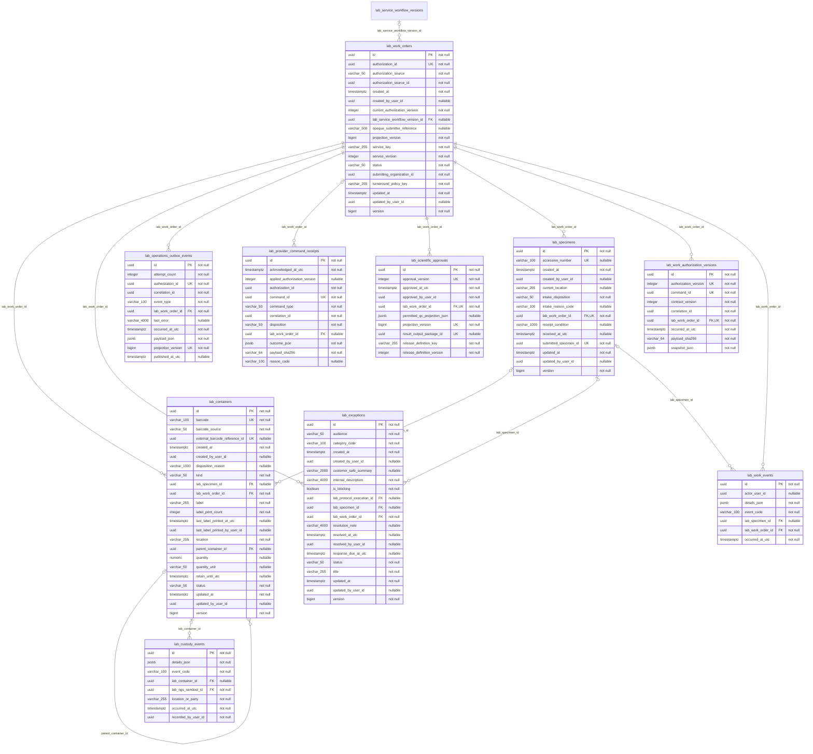
```mermaid
erDiagram
    lab_containers {
        uuid id PK "not null"
        varchar_100 barcode UK "not null"
        varchar_50 barcode_source "not null"
        uuid external_barcode_reference_id UK "nullable"
        timestamptz created_at "not null"
        uuid created_by_user_id "nullable"
        varchar_1000 disposition_reason "nullable"
        varchar_50 kind "not null"
        uuid lab_specimen_id FK "nullable"
        uuid lab_work_order_id FK "not null"
        varchar_255 label "not null"
        integer label_print_count "not null"
        timestamptz last_label_printed_at_utc "nullable"
        uuid last_label_printed_by_user_id "nullable"
        varchar_255 location "not null"
        uuid parent_container_id FK "nullable"
        numeric quantity "nullable"
        varchar_50 quantity_unit "nullable"
        timestamptz retain_until_utc "nullable"
        varchar_50 status "not null"
        timestamptz updated_at "not null"
        uuid updated_by_user_id "nullable"
        bigint version "not null"
    }
    lab_custody_events {
        uuid id PK "not null"
        jsonb details_json "not null"
        varchar_100 event_code "not null"
        uuid lab_container_id FK "nullable"
        uuid lab_ngs_sendout_id FK "not null"
        varchar_255 location_or_party "not null"
        timestamptz occurred_at_utc "not null"
        uuid recorded_by_user_id "not null"
    }
    lab_exceptions {
        uuid id PK "not null"
        varchar_50 audience "not null"
        varchar_100 category_code "not null"
        timestamptz created_at "not null"
        uuid created_by_user_id "nullable"
        varchar_2000 customer_safe_summary "nullable"
        varchar_4000 internal_description "not null"
        boolean is_blocking "not null"
        uuid lab_protocol_execution_id FK "nullable"
        uuid lab_specimen_id FK "nullable"
        uuid lab_work_order_id FK "not null"
        varchar_4000 resolution_note "nullable"
        timestamptz resolved_at_utc "nullable"
        uuid resolved_by_user_id "nullable"
        timestamptz response_due_at_utc "nullable"
        varchar_50 status "not null"
        varchar_255 title "not null"
        timestamptz updated_at "not null"
        uuid updated_by_user_id "nullable"
        bigint version "not null"
    }
    lab_operations_outbox_events {
        uuid id PK "not null"
        integer attempt_count "not null"
        uuid authorization_id UK "not null"
        uuid correlation_id "not null"
        varchar_100 event_type "not null"
        uuid lab_work_order_id FK "not null"
        varchar_4000 last_error "nullable"
        timestamptz occurred_at_utc "not null"
        jsonb payload_json "not null"
        bigint projection_version UK "not null"
        timestamptz published_at_utc "nullable"
    }
    lab_provider_command_receipts {
        uuid id PK "not null"
        timestamptz acknowledged_at_utc "not null"
        integer applied_authorization_version "nullable"
        uuid authorization_id "not null"
        uuid command_id UK "not null"
        varchar_50 command_type "not null"
        uuid correlation_id "not null"
        varchar_50 disposition "not null"
        uuid lab_work_order_id FK "nullable"
        jsonb outcome_json "not null"
        varchar_64 payload_sha256 "not null"
        varchar_100 reason_code "nullable"
    }
    lab_scientific_approvals {
        uuid id PK "not null"
        integer approval_version UK "not null"
        timestamptz approved_at_utc "not null"
        uuid approved_by_user_id "not null"
        uuid lab_work_order_id FK,UK "not null"
        jsonb permitted_qc_projection_json "nullable"
        bigint projection_version UK "not null"
        uuid result_output_package_id UK "nullable"
        varchar_255 release_definition_key "not null"
        integer release_definition_version "not null"
    }
    lab_specimens {
        uuid id PK "not null"
        varchar_100 accession_number UK "nullable"
        timestamptz created_at "not null"
        uuid created_by_user_id "nullable"
        varchar_255 current_location "nullable"
        varchar_50 intake_disposition "not null"
        varchar_100 intake_reason_code "nullable"
        uuid lab_work_order_id FK,UK "not null"
        varchar_1000 receipt_condition "nullable"
        timestamptz received_at_utc "nullable"
        uuid submitted_specimen_id UK "not null"
        timestamptz updated_at "not null"
        uuid updated_by_user_id "nullable"
        bigint version "not null"
    }
    lab_work_authorization_versions {
        uuid id PK "not null"
        integer authorization_version UK "not null"
        uuid command_id UK "not null"
        integer contract_version "not null"
        uuid correlation_id "not null"
        uuid lab_work_order_id FK,UK "not null"
        timestamptz occurred_at_utc "not null"
        varchar_64 payload_sha256 "not null"
        jsonb snapshot_json "not null"
    }
    lab_work_events {
        uuid id PK "not null"
        uuid actor_user_id "nullable"
        jsonb details_json "not null"
        varchar_100 event_code "not null"
        uuid lab_specimen_id FK "nullable"
        uuid lab_work_order_id FK "not null"
        timestamptz occurred_at_utc "not null"
    }
    lab_work_orders {
        uuid id PK "not null"
        uuid authorization_id UK "not null"
        varchar_50 authorization_source "not null"
        uuid authorization_source_id "not null"
        timestamptz created_at "not null"
        uuid created_by_user_id "nullable"
        integer current_authorization_version "not null"
        uuid lab_service_workflow_version_id FK "nullable"
        varchar_500 opaque_submitter_reference "nullable"
        bigint projection_version "not null"
        varchar_255 service_key "not null"
        integer service_version "not null"
        varchar_50 status "not null"
        uuid submitting_organization_id "not null"
        varchar_255 turnaround_policy_key "not null"
        timestamptz updated_at "not null"
        uuid updated_by_user_id "nullable"
        bigint version "not null"
    }
    lab_containers o|--o{ lab_containers : "parent_container_id"
    lab_specimens o|--o{ lab_containers : "lab_specimen_id"
    lab_work_orders ||--o{ lab_containers : "lab_work_order_id"
    lab_containers o|--o{ lab_custody_events : "lab_container_id"
    lab_specimens o|--o{ lab_exceptions : "lab_specimen_id"
    lab_work_orders ||--o{ lab_exceptions : "lab_work_order_id"
    lab_work_orders ||--o{ lab_operations_outbox_events : "lab_work_order_id"
    lab_work_orders o|--o{ lab_provider_command_receipts : "lab_work_order_id"
    lab_work_orders ||--o{ lab_scientific_approvals : "lab_work_order_id"
    lab_work_orders ||--o{ lab_specimens : "lab_work_order_id"
    lab_work_orders ||--o{ lab_work_authorization_versions : "lab_work_order_id"
    lab_specimens o|--o{ lab_work_events : "lab_specimen_id"
    lab_work_orders ||--o{ lab_work_events : "lab_work_order_id"
    lab_service_workflow_versions o|--o{ lab_work_orders : "lab_service_workflow_version_id"
```

### Protocols, libraries, and batches

```mermaid
erDiagram
    lab_batch_members {
        uuid id PK "not null"
        timestamptz added_at_utc "not null"
        uuid lab_library_id FK,UK "not null"
        uuid lab_operational_batch_id FK,UK "not null"
        uuid lab_work_order_id FK "not null"
    }
    lab_libraries {
        uuid id PK "not null"
        timestamptz created_at "not null"
        uuid created_by_user_id "nullable"
        uuid lab_specimen_id FK "not null"
        uuid lab_work_order_id FK "not null"
        uuid library_container_id FK "not null"
        varchar_100 library_key UK "not null"
        uuid preparation_execution_id FK "not null"
        jsonb qc_results_json "nullable"
        uuid source_container_id FK "not null"
        varchar_50 status "not null"
        timestamptz updated_at "not null"
        uuid updated_by_user_id "nullable"
        bigint version "not null"
    }
    lab_ngs_sendouts {
        uuid id PK "not null"
        timestamptz created_at "not null"
        uuid created_by_user_id "nullable"
        timestamptz expected_completion_at_utc "nullable"
        uuid lab_operational_batch_id FK,UK "not null"
        jsonb manifest_json "not null"
        varchar_255 provider_name "not null"
        timestamptz provider_received_at_utc "nullable"
        varchar_255 provider_reference "nullable"
        timestamptz shipped_at_utc "nullable"
        varchar_50 status "not null"
        timestamptz updated_at "not null"
        uuid updated_by_user_id "nullable"
        bigint version "not null"
    }
    lab_operational_batches {
        uuid id PK "not null"
        varchar_100 batch_number UK "not null"
        varchar_100 batch_type "not null"
        timestamptz completed_at_utc "nullable"
        timestamptz created_at "not null"
        uuid created_by_user_id "nullable"
        varchar_255 name "not null"
        varchar_4000 notes "nullable"
        timestamptz started_at_utc "nullable"
        varchar_50 status "not null"
        timestamptz updated_at "not null"
        uuid updated_by_user_id "nullable"
        bigint version "not null"
    }
    lab_protocol_executions {
        uuid id PK "not null"
        uuid assigned_to_user_id "nullable"
        jsonb captured_results_json "not null"
        timestamptz completed_at_utc "nullable"
        timestamptz created_at "not null"
        uuid created_by_user_id "nullable"
        varchar_4000 deviation_note "nullable"
        uuid lab_protocol_version_id FK "not null"
        uuid lab_service_workflow_stage_id FK "nullable"
        uuid lab_specimen_id FK "nullable"
        uuid lab_work_order_id FK "not null"
        timestamptz started_at_utc "nullable"
        varchar_50 status "not null"
        timestamptz updated_at "not null"
        uuid updated_by_user_id "nullable"
        bigint version "not null"
    }
    lab_protocol_versions {
        uuid id PK "not null"
        timestamptz approved_at_utc "nullable"
        uuid approved_by_user_id "nullable"
        timestamptz authored_at_utc "not null"
        uuid authored_by_user_id "not null"
        jsonb definition_json "not null"
        uuid lab_protocol_id FK,UK "not null"
        integer protocol_version UK "not null"
        varchar_50 status "not null"
    }
    lab_protocols {
        uuid id PK "not null"
        timestamptz created_at "not null"
        uuid created_by_user_id "nullable"
        varchar_2000 description "nullable"
        varchar_100 key UK "not null"
        integer latest_version "not null"
        varchar_255 name "not null"
        timestamptz updated_at "not null"
        uuid updated_by_user_id "nullable"
        bigint version "not null"
    }
    lab_service_workflows {
        uuid id PK "not null"
        timestamptz created_at "not null"
        uuid created_by_user_id "nullable"
        varchar_2000 description "nullable"
        integer latest_version "not null"
        varchar_255 name "not null"
        varchar_255 service_key UK "not null"
        timestamptz updated_at "not null"
        uuid updated_by_user_id "nullable"
        bigint version "not null"
    }
    lab_service_workflow_versions {
        uuid id PK "not null"
        timestamptz approved_at_utc "nullable"
        uuid approved_by_user_id "nullable"
        timestamptz authored_at_utc "not null"
        uuid authored_by_user_id "not null"
        timestamptz created_at "not null"
        uuid created_by_user_id "nullable"
        uuid lab_service_workflow_id FK,UK "not null"
        timestamptz production_at_utc "nullable"
        uuid production_by_user_id "nullable"
        varchar_50 status "not null"
        timestamptz updated_at "not null"
        uuid updated_by_user_id "nullable"
        bigint version "not null"
        integer workflow_version UK "not null"
    }
    lab_service_workflow_stages {
        uuid id PK "not null"
        varchar_1000 condition "nullable"
        varchar_2000 handoff_criteria "nullable"
        uuid lab_protocol_version_id FK "not null"
        uuid lab_service_workflow_version_id FK,UK "not null"
        varchar_255 name "not null"
        varchar_50 requirement "not null"
        integer sequence UK "not null"
    }
    lab_libraries ||--o{ lab_batch_members : "lab_library_id"
    lab_operational_batches ||--o{ lab_batch_members : "lab_operational_batch_id"
    lab_protocol_executions ||--o{ lab_libraries : "preparation_execution_id"
    lab_operational_batches ||--o{ lab_ngs_sendouts : "lab_operational_batch_id"
    lab_protocol_versions ||--o{ lab_protocol_executions : "lab_protocol_version_id"
    lab_protocols ||--o{ lab_protocol_versions : "lab_protocol_id"
    lab_protocol_versions ||--o{ lab_service_workflow_stages : "lab_protocol_version_id"
    lab_service_workflows ||--o{ lab_service_workflow_versions : "lab_service_workflow_id"
    lab_service_workflow_versions ||--o{ lab_service_workflow_stages : "lab_service_workflow_version_id"
    lab_service_workflow_stages o|--o{ lab_protocol_executions : "lab_service_workflow_stage_id"
```

### Materials and equipment

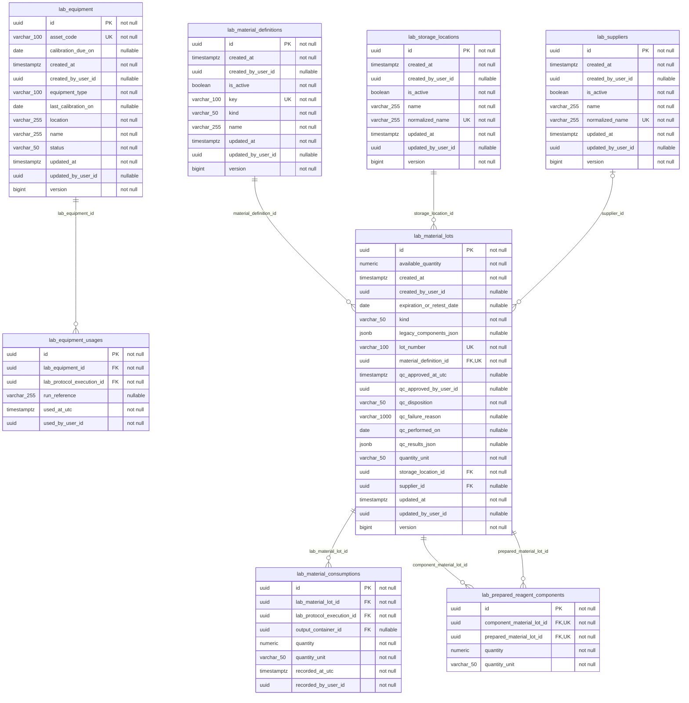
```mermaid
erDiagram
    lab_equipment {
        uuid id PK "not null"
        varchar_100 asset_code UK "not null"
        date calibration_due_on "nullable"
        timestamptz created_at "not null"
        uuid created_by_user_id "nullable"
        varchar_100 equipment_type "not null"
        date last_calibration_on "nullable"
        varchar_255 location "not null"
        varchar_255 name "not null"
        varchar_50 status "not null"
        timestamptz updated_at "not null"
        uuid updated_by_user_id "nullable"
        bigint version "not null"
    }
    lab_equipment_usages {
        uuid id PK "not null"
        uuid lab_equipment_id FK "not null"
        uuid lab_protocol_execution_id FK "not null"
        varchar_255 run_reference "nullable"
        timestamptz used_at_utc "not null"
        uuid used_by_user_id "not null"
    }
    lab_material_consumptions {
        uuid id PK "not null"
        uuid lab_material_lot_id FK "not null"
        uuid lab_protocol_execution_id FK "not null"
        uuid output_container_id FK "nullable"
        numeric quantity "not null"
        varchar_50 quantity_unit "not null"
        timestamptz recorded_at_utc "not null"
        uuid recorded_by_user_id "not null"
    }
    lab_material_definitions {
        uuid id PK "not null"
        timestamptz created_at "not null"
        uuid created_by_user_id "nullable"
        boolean is_active "not null"
        varchar_100 key UK "not null"
        varchar_50 kind "not null"
        varchar_255 name "not null"
        timestamptz updated_at "not null"
        uuid updated_by_user_id "nullable"
        bigint version "not null"
    }
    lab_material_lots {
        uuid id PK "not null"
        numeric available_quantity "not null"
        timestamptz created_at "not null"
        uuid created_by_user_id "nullable"
        date expiration_or_retest_date "nullable"
        varchar_50 kind "not null"
        jsonb legacy_components_json "nullable"
        varchar_100 lot_number UK "not null"
        uuid material_definition_id FK,UK "not null"
        timestamptz qc_approved_at_utc "nullable"
        uuid qc_approved_by_user_id "nullable"
        varchar_50 qc_disposition "not null"
        varchar_1000 qc_failure_reason "nullable"
        date qc_performed_on "nullable"
        jsonb qc_results_json "nullable"
        varchar_50 quantity_unit "not null"
        uuid storage_location_id FK "not null"
        uuid supplier_id FK "nullable"
        timestamptz updated_at "not null"
        uuid updated_by_user_id "nullable"
        bigint version "not null"
    }
    lab_prepared_reagent_components {
        uuid id PK "not null"
        uuid component_material_lot_id FK,UK "not null"
        uuid prepared_material_lot_id FK,UK "not null"
        numeric quantity "not null"
        varchar_50 quantity_unit "not null"
    }
    lab_storage_locations {
        uuid id PK "not null"
        timestamptz created_at "not null"
        uuid created_by_user_id "nullable"
        boolean is_active "not null"
        varchar_255 name "not null"
        varchar_255 normalized_name UK "not null"
        timestamptz updated_at "not null"
        uuid updated_by_user_id "nullable"
        bigint version "not null"
    }
    lab_suppliers {
        uuid id PK "not null"
        timestamptz created_at "not null"
        uuid created_by_user_id "nullable"
        boolean is_active "not null"
        varchar_255 name "not null"
        varchar_255 normalized_name UK "not null"
        timestamptz updated_at "not null"
        uuid updated_by_user_id "nullable"
        bigint version "not null"
    }
    lab_equipment ||--o{ lab_equipment_usages : "lab_equipment_id"
    lab_material_lots ||--o{ lab_material_consumptions : "lab_material_lot_id"
    lab_material_definitions ||--o{ lab_material_lots : "material_definition_id"
    lab_storage_locations ||--o{ lab_material_lots : "storage_location_id"
    lab_suppliers o|--o{ lab_material_lots : "supplier_id"
    lab_material_lots ||--o{ lab_prepared_reagent_components : "component_material_lot_id"
    lab_material_lots ||--o{ lab_prepared_reagent_components : "prepared_material_lot_id"
```

### Laboratory roles

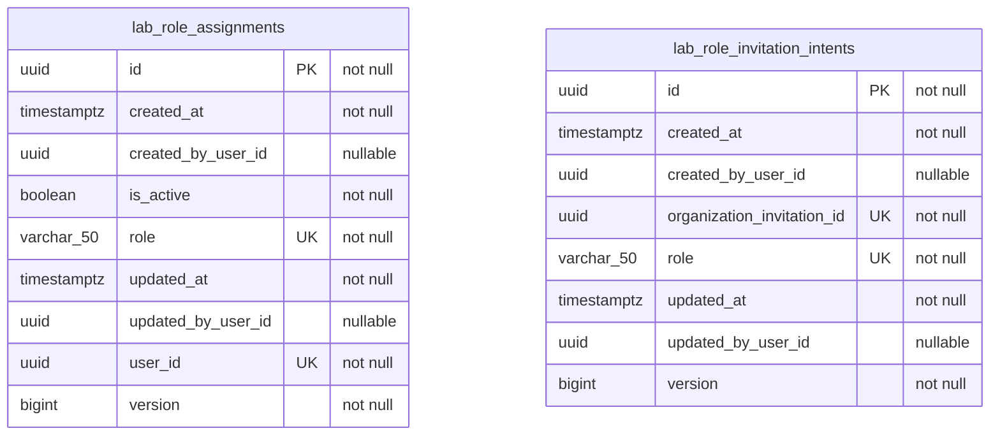
```mermaid
erDiagram
    lab_role_assignments {
        uuid id PK "not null"
        timestamptz created_at "not null"
        uuid created_by_user_id "nullable"
        boolean is_active "not null"
        varchar_50 role UK "not null"
        timestamptz updated_at "not null"
        uuid updated_by_user_id "nullable"
        uuid user_id UK "not null"
        bigint version "not null"
    }
    lab_role_invitation_intents {
        uuid id PK "not null"
        timestamptz created_at "not null"
        uuid created_by_user_id "nullable"
        uuid organization_invitation_id UK "not null"
        varchar_50 role UK "not null"
        timestamptz updated_at "not null"
        uuid updated_by_user_id "nullable"
        bigint version "not null"
    }
```

### Cross-section relationships

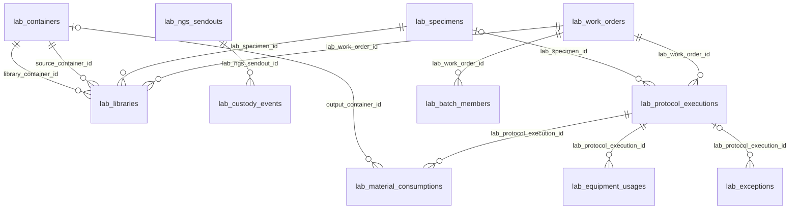
```mermaid
erDiagram
    lab_containers ||--o{ lab_libraries : "library_container_id"
    lab_containers ||--o{ lab_libraries : "source_container_id"
    lab_containers o|--o{ lab_material_consumptions : "output_container_id"
    lab_ngs_sendouts ||--o{ lab_custody_events : "lab_ngs_sendout_id"
    lab_protocol_executions ||--o{ lab_equipment_usages : "lab_protocol_execution_id"
    lab_protocol_executions o|--o{ lab_exceptions : "lab_protocol_execution_id"
    lab_protocol_executions ||--o{ lab_material_consumptions : "lab_protocol_execution_id"
    lab_specimens ||--o{ lab_libraries : "lab_specimen_id"
    lab_specimens o|--o{ lab_protocol_executions : "lab_specimen_id"
    lab_work_orders ||--o{ lab_batch_members : "lab_work_order_id"
    lab_work_orders ||--o{ lab_libraries : "lab_work_order_id"
    lab_work_orders ||--o{ lab_protocol_executions : "lab_work_order_id"
```

## `website` schema

### Public website intake

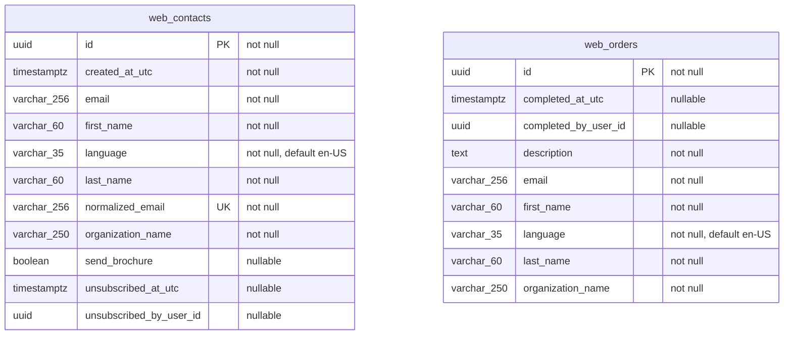
```mermaid
erDiagram
    web_contacts {
        uuid id PK "not null"
        timestamptz created_at_utc "not null"
        varchar_256 email "not null"
        varchar_60 first_name "not null"
        varchar_35 language "not null, default en-US"
        varchar_60 last_name "not null"
        varchar_256 normalized_email UK "not null"
        varchar_250 organization_name "not null"
        boolean send_brochure "nullable"
        timestamptz unsubscribed_at_utc "nullable"
        uuid unsubscribed_by_user_id "nullable"
    }
    web_orders {
        uuid id PK "not null"
        timestamptz completed_at_utc "nullable"
        uuid completed_by_user_id "nullable"
        text description "not null"
        varchar_256 email "not null"
        varchar_60 first_name "not null"
        varchar_35 language "not null, default en-US"
        varchar_60 last_name "not null"
        varchar_250 organization_name "not null"
    }
```

## Cross-schema relationships

The current model defines no database-enforced foreign keys between schemas. Cross-module handoffs use explicit identifiers, contracts, receipts, projections, and outbox records instead.
