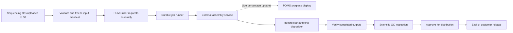

# Sequencing data assembly and job traceability

Status: implementation authorized September 22, 2026, through the endpoint-independent boundary. The owner confirmed that a sample sequenced multiple times must have a **separate result for each sequencing run**. The owner subsequently requested recording and executing this plan as far as possible without the external endpoint contract, URL or credentials, then explicitly authorized commit, push and deployment. Shared/production migration approval remains separate; see the [release record](../operations/sequencing-assembly-release-20260922.md).

## Authorized endpoint-independent implementation

Implement durable job records, actual start/stop timestamps and final disposition, a server-side background runner with a provider interface, ephemeral progress, scoped APIs, a view-first POMS workspace and focused verification fixtures. The production provider remains unavailable until its real contract and input/output verification requirements are supplied. Simulated processing is restricted to automated verification; it must never create scientific evidence or customer results in normal operation. Keep actual SignalR method names, credentials and payload translation out of the implementation until agreed with the external developer.

Use the existing authenticated API and TanStack Query polling for the initial live progress display (five-second refresh while active), avoiding a new browser authentication transport or dependencies at this stage. This preserves the proposed transport-independent progress behavior; a POMS push hub can replace polling with the same authorization and ephemeral data rules when the integration is completed. Shared result guards and existing QC/release remain authoritative.

Owner clarification: percentage progress is live display information, not retained history. Relay it to POMS users without saving each update. Persist the job's identity, request/start facts and final disposition with the evidence needed for traceability. This supersedes the initial proposal to journal every provider progress event.

The owner also explicitly requires actual job start and stop timestamps. Store provider-reported `startedAtUtc` and `stoppedAtUtc` for every executed attempt, whether it succeeds, fails or is terminated. Derive elapsed duration from these times and display them in the user's time zone. Keep request time and POMS receipt time separate; delayed delivery must not change the actual execution times. A job cancelled or rejected before execution has no invented start time: retain its final-disposition time and indicate that it never started. Missing actual timestamps remain visibly incomplete and must be reconciled with the provider rather than replaced by receipt time.

## Product outcome and users

After sequencing data arrive in S3, an authorized POMS laboratory user can start assembly, follow its progress, investigate every attempt, submit its outputs for scientific QC, and release approved results through the existing customer-distribution workflow. Closing the browser must not interrupt assembly or lose its history.

The requesting operator, external processing service, scientific reviewer and release manager have distinct responsibilities. Existing laboratory and release permissions remain authoritative. Customers see only explicitly released deliverables; provider progress and internal diagnostic details remain internal.

The unit of work is one identified sample and one purchased sequencing-run allocation. The instrument run, library preparation, commercial Job and assembly attempt retain separate identities. Multiple files or lanes may feed the same allocation. Combining different purchased runs is excluded, including when they reuse one library. A retry or reanalysis creates another linked assembly attempt for that allocation and never increases purchased-run counts.

## Existing foundations and gaps

Current source already provides immutable sequencing outputs, completed analyses and their input links, scientific evidence requirements, versioned result packages, QC approval, customer release and sample investigation history. Reuse these records and the existing API envelope, transactions, authorization and audit infrastructure.

| Current component | Reuse and required extension |
| --- | --- |
| [Lineage service](../../backend/app/Features/LabOperations/Services/LabResultLineageService.cs) and [capture contract](LAB-RESULT-LINEAGE-CONTRACT.md) | `LabAnalysisRun` records a completed-analysis declaration. Add a separate assembly-attempt lifecycle; do not turn failed or merely requested work into a completed analysis. |
| [Run accounting](../../backend/app/Features/LabOperations/Services/LabSequencingRunProgress.cs) and [sequencing-run plan](SAMPLE-SEQUENCING-RUNS-PLAN.md) | Preserve counts by sample/run allocation. Current analysis registration checks the same specimen, preparation attempt and source tube, but does not explicitly reject different purchased-run numbers within that input set. Add that check to shared capture and downstream approval/release validation. |
| [Configured pipeline adapter](../../backend/app/Features/OrderManagement/Services/ConfiguredPSeqResultPipelineAdapter.cs) | Currently registers a manifest/transfer submission; it does not dispatch or monitor external computation. Keep transfer identity distinct from execution identity. |
| [Scientific approval](../../backend/app/Features/LabOperations/Controllers/LabOperationsController.Release.cs), [result packages](../../backend/app/Features/OrderManagement/Controllers/PSeqResultPackagesController.cs) and [evidence governance](LAB-EVIDENCE-GOVERNANCE-CONTRACT.md) | Preserve input/output attribution, file verification and scan admission, reviewer rules, holds, release authority and customer-delivery accounting. |
| [Lab navigation](../../frontend/src/features/lab-operations/LabOperationsPage.tsx) | Data assembly currently hosts commercial assembly cases. Extend that workspace with a Sequencing runs tab while preserving existing cases and their routes. |

Older architecture notes that describe all pipeline provenance as undefined are superseded by these implemented contracts. This plan fills the live job-execution gap; source inspection does not establish that a real external assembly integration has been verified.

## End-to-end workflow

Failure or termination ends that attempt with its evidence retained. It does not advance to QC or distribution. A subsequent attempt links back to it with a reason. Assembly success, QC approval and customer release are separate milestones.

1. **Register uploaded data.** The producer publishes a completion manifest after all required files are uploaded. POMS records the upload/completion evidence, associates each input with existing sample, tube, library, sendout and sequencing-run lineage, and verifies availability and integrity before permitting Start assembly. A nonempty S3 folder is not evidence that upload is complete.
2. **Request assembly.** The operator selects the sample/run and a configured processing recipe, reviews the verified input set, and confirms. The server rechecks scope, parent authorization, holds, run allocation and prerequisites. It freezes inputs and configuration and saves the attempt, initiating-user event and dispatch request atomically.
3. **Run and observe.** A server-side worker starts the external process through its SignalR endpoint. Persist provider acceptance, actual start and final disposition. Relay percentage updates to the POMS UI as transient information; do not write a database row, update a persisted percentage field or create an audit entry for each update.
4. **Receive and inspect outputs.** On external success, verify the exact output manifest, expected files, checksums, attribution and required scientific evidence. Register the completed analysis and its result package through existing services, idempotently. The package becomes eligible for QC only after all existing file and scan requirements pass. A processing percentage of 100 does not substitute for completion or valid outputs.
5. **Approve and distribute.** A permitted reviewer records QC evidence and the decision against the exact result version. Rejection/hold retains the evidence and blocks release; a reanalysis requires its own attempt and fresh review. Approval permits the existing release manager workflow; it does not itself publish files. Customer release remains subject to current commercial/Trial rules. A commercial Job closes only when its required per-sample/run deliveries satisfy current customer-access rules.

## Input and output identity in S3

Store an immutable manifest version and hash, exact bucket/key/object-version identifiers, file roles, size, full-file SHA-256 and the evidence source. Require an explicit completion declaration with producer occurrence time and POMS receipt time. Record POMS verification time separately; do not invent an upload start or use object modification time as proof of one.

Prefer existing S3 object version IDs. Where versioning is unavailable, require immutable uniquely named objects and a verified manifest; a mutable folder prefix alone cannot identify scientific inputs. Detect missing or changed objects before starting and when validating outputs. Inputs must resolve to registered sequencing outputs for exactly one purchased run. Existing historical null run numbers retain the established run-1 interpretation; never infer a split across allocations.

Checksums must identify both algorithm and type. Do not substitute an ETag or a multipart composite checksum for full-file SHA-256. Use a trusted full-byte verification path and record whether evidence is independently verified or producer-declared; missing verification remains visible and blocks the required gate. AWS documents [checksum distinctions](https://docs.aws.amazon.com/AmazonS3/latest/userguide/checking-object-integrity-upload.html) and [object-version identity](https://docs.aws.amazon.com/AmazonS3/latest/userguide/versioning-workflows.html).

The initial scope consumes the producer's upload-complete manifest. Automatic discovery through S3 notifications can follow separately; notifications are [delivered at least once](https://docs.aws.amazon.com/AmazonS3/latest/userguide/EventNotifications.html), so they would still require deduplication and reconciliation. This does not add a browser uploader for sequencing datasets or relocate existing Portal storage.

## Durable runner and SignalR integration

Use the existing PostgreSQL operational store and background-worker conventions. Keep the computation in the external service. SignalR carries commands and notifications; durable POMS records remain the source for lifecycle history and final disposition. Live percentage progress is transient. SignalR's [bounded reconnect buffering](https://learn.microsoft.com/en-us/aspnet/core/signalr/configuration?view=aspnetcore-10.0) does not replace durable lifecycle evidence.

- A start request returns the saved attempt ID after a transaction commits the frozen request and outbox entry. A repeated request with the same idempotency key and content returns that attempt; changed content conflicts. Enforce at most one active attempt for a sample/run, including concurrent operator requests.
- A leased worker claims dispatch entries, applies configured concurrency limits and invokes the provider with the stable POMS attempt ID. Persist provider acknowledgement and provider job ID. Recheck authorization/holds before an undispatched job is sent; retain a blocked request visibly for resolution.
- Require provider idempotent start and authoritative lookup by the POMS attempt ID for automatic recovery. After an ambiguous timeout, reconcile before sending another start. A temporary lookup miss does not prove an earlier command cannot still execute. If idempotent start is unavailable, block automatic redispatch until there is definitive evidence that the original request was rejected and cannot run; otherwise surface the uncertain request for investigation. Do not promise exactly-once computation from transport retries.
- The external adapter owns connection setup, initial connection retry, reconnect, credentials and protocol translation. Confirm whether the endpoint uses ASP.NET Core SignalR or an older incompatible protocol before selecting the client. No browser connection or credentials go directly to the external processing service.
- Separate lifecycle messages from progress messages. Lifecycle messages identify the POMS/provider job, stable event ID or equivalent deduplication identity, occurrence time, actual start/end times and applicable outcome metadata. Save each meaningful lifecycle transition and its current status atomically; acknowledge durable lifecycle delivery only after commit. Record receipt time separately. Repeated observations of an unchanged status do not create history entries.
- Progress messages need the correlated job ID, percentage and freshness information; optional stage/sequence details depend on the provider contract. Forward them through the POMS-owned authorized hub, keeping at most the latest value in volatile memory with a freshness limit. Percentage, stage and heartbeat updates create no database, inbox, outbox, audit or per-message application-log writes. Do not retain a progress series or request replay of missed percentages.
- Exact duplicate lifecycle messages are harmless; conflicting messages with the same identity require investigation. Preserve late lifecycle evidence without regressing the confirmed state. Conflicting terminal outcomes require an authoritative provider status check and an appended reconciliation record. Discard stale/out-of-order live progress where sequence information permits; progress received after a terminal outcome cannot reopen the job.
- After disconnect or worker/API restart, recover active attempts from the database and reconcile start and final disposition through an authoritative provider summary or lifecycle replay. The provider must retain enough information to recover missed actual start/end times and terminal outcomes. Losing transient percentages is acceptable and never triggers job redispatch.
- Publish committed lifecycle changes reliably; reserve durable notification entries for these meaningful transitions. The UI loads the persisted lifecycle snapshot plus a fresh cached/provider percentage when available. On refresh/reconnect, recover the latest percentage from the provider or wait for its next update, showing progress unavailable or reconnecting meanwhile. Polling may refresh current status as a fallback, without persisting unchanged status or percentages. A missed UI notification must never lose the stored final disposition.

Dependency scope for the later live integration is a .NET SignalR client and, if a push hub is introduced, the browser SignalR client. The existing AWS SDK can support scoped S3 checks. The endpoint-independent implementation adds no dependencies or authentication contracts; record the concrete external contract and package scope before implementing the live adapter.

## State and recovery rules

| Execution state | Meaning and transition rule |
| --- | --- |
| Queued / Dispatching | Saved locally; provider execution is not yet established. A queued cancellation can finish locally only while dispatch is atomically prevented. |
| Accepted | Provider acknowledges this exact attempt; actual execution may not have started. |
| Running | Provider confirms actual start. Retain start time; show current percentage without retaining its update history. |
| Cancellation requested | POMS recorded the requester and reason. Execution remains active until the provider confirms its outcome. |
| Succeeded | Provider confirms successful completion and actual completion time. Output validation is a separate pending/passed/failed status. |
| Failed | Provider confirms execution failure, with reason/exit details and any available logs. |
| Terminated | Provider confirms execution was stopped, with initiator/reason where known and actual stop time. |
| Cancelled before start | Dispatch was prevented and there is evidence that no external execution began. |

Connection loss, stale heartbeat and unknown outcome are communication/attention conditions, not invented execution failures. Show the last confirmed lifecycle state and its recorded time; show progress freshness separately using transient data. Clear or mark stale a percentage when it is no longer current. Never automatically start a replacement while the earlier execution may still be running. A success-versus-cancellation race is reconciled against the provider's authoritative outcome.

Cancellation is offered only when the provider contract supports it safely. System/provider termination must be recorded even if user-initiated cancellation is unavailable. Browser closure never cancels a job. A later laboratory hold does not prevent live progress display or capture of start/final-disposition evidence; it blocks further processing admission and distribution while preserving the outcome. Existing material-failure and purchased-run rules are not changed by compute failure.

## Persisted traceability

Add feature-owned assembly-attempt records, a sparse append-only lifecycle journal with deduplication, and durable command/lifecycle-notification outboxes. Persist request, provider acceptance, actual start, cancellation request if applicable and final disposition; retain meaningful corrections or reconciliation decisions. Do not include percentage/stage/heartbeat messages or routine polling observations in these stores. An attempt is scoped to organization, Lab Job, specimen, purchased run, preparation/source lineage and its fixed input manifest. Its current lifecycle status is a projection of retained facts. Preserve optimistic concurrency, restrictive references and centralized audit stamping; update the complete ERD with any eventual schema change.

| Milestone | Evidence retained |
| --- | --- |
| Upload complete / input verified | Producer, occurrence/receipt/verification times, manifest identity/hash, exact input object versions, sizes, checksums, file roles and registered sequencing-output IDs. |
| Assembly requested / accepted | Requester, POMS attempt/idempotency key, parent scope, frozen recipe and parameters/hash, provider identity/job ID, acceptance time and dispatch/reconciliation history. |
| Assembly started | Actual provider start time and POMS receipt time, software/pipeline/container version where applicable and reference versions. Percentage, stage updates and heartbeats are excluded from retained history. |
| Completion / failure / termination | Actual job stop timestamp and final disposition, POMS receipt time, reason/exit detail, retained diagnostic references and checksums, stop requester/confirmation if applicable, output manifest and integrity evidence when produced. Preserve the start timestamp and derive elapsed duration for each executed attempt. |
| Scientific QC | Exact analysis/package version, review criteria/version, measurements or checksummed supporting evidence, reviewer, decision, time, reason and applicable independence checks. |
| Distribution | Approved result version, release authority, timestamp, scope and link to the existing customer-access/release record; later corrections retain predecessors. |

Link all attempts into the existing sample investigation and reports, including those with no result. A successful attempt links to exactly one immutable completed `LabAnalysisRun`; failed attempts have no fabricated completed analysis. Retrying a failed attempt links the attempt predecessor; reanalysing a completed result also uses the existing analysis predecessor/reason relationship. Record initiating users in Lab work events so existing reviewer-contribution rules remain effective, while recording service identity separately.

Extend shared analysis-input validation and all current result/review/release guards to require exactly one purchased run. Check existing records for mixed-run inputs; preserve and flag them, blocking further advancement until an explicitly captured replacement is available. Do not silently alter evidence or multiply one combined result into several run completions.

Retain internal lifecycle history and traceability metadata indefinitely under the existing governance decision. Transient progress is excluded from retention, investigation reports and audit exports. Customer file expiry is separate. Externally stored raw files, outputs and diagnostic references retain their documented ownership; agree preservation/retrieval responsibilities before production. Do not copy provider progress logs into retained POMS evidence merely to recreate the discarded percentage history. This plan does not silently enable bucket versioning, add a new retention commitment or treat a saved URL as proof that bytes are preserved.

## POMS experience and access

Add a Sequencing runs queue within Data assembly and links from each sample's sequencing/analysis history. Keep existing commercial assembly cases available in their own tab. The queue is a form-free view with sample/run identity, lifecycle state, live percentage and freshness, and attention filters. The primary identifier opens a view-first attempt detail page with inputs, a concise lifecycle timeline, final disposition, diagnostic references, outputs and QC/release links. There is no historical progress chart or percentage-update feed.

Use bounded Start, Retry/reanalyse and Request cancellation dialogs; explain blockers and require reasons for retries and cancellation. Use one Actions menu where a context offers multiple actions, and preserve filters/focus on return. Show the provider's current percentage; if it also supplies stage-specific progress, label that meaning clearly. Display an indeterminate state when progress is unavailable or stale, and do not invent completion estimates. Separate output validation, QC and distribution status from execution progress. Once the job ends, its final disposition replaces the live percentage display.

Reuse TanStack Query and existing semantic tokens. Meet keyboard, screen-reader, contrast, responsive and reduced-motion requirements; throttle progress announcements so they remain usable. Enforce scope on every read/write and hub subscription server-side. Revalidate access on reconnect and remove subscriptions when access is revoked; never trust a client-supplied organization/group name. Keep credentials, tokens, signed URLs and sensitive raw logs out of progress payloads and audit text. S3 access uses configured, least-privilege locations, not arbitrary operator-entered endpoints.

## External developer handoff required before live integration

Obtain the actual endpoint contract and sample messages, then record an agreed, versioned integration contract covering:

1. Test/production hub addresses, SignalR protocol/runtime, authentication, TLS/network access and supported transport.
2. Start request/acknowledgement, idempotency behavior, POMS-to-provider job correlation, authoritative lifecycle summary or lifecycle replay, final-outcome retention and restart recovery. Progress replay is not required.
3. Percentage meaning, update/heartbeat intervals, latest-progress lookup if available, actual start/end times, all terminal states and sanitized diagnostic references. Distinguish transient progress from durable lifecycle messages even if both arrive in one payload.
4. Cancellation support, acknowledgement versus confirmed termination, races and jobs that cannot safely stop.
5. Recipe/software/settings/reference identity and exact input/output manifest schemas, sample/run mapping and full-file checksum provenance.
6. S3 region/bucket access, upload completion signaling, object immutability/version availability, preservation ownership and retrieval verification.

Agree operational thresholds from this contract: bounded concurrency, dispatch retry policy, expected update interval and stale-job alert threshold. Set a target of showing accepted provider updates within 10 seconds under normal operation, measuring from server receipt separately from provider reporting delay. Missing essential idempotency/reconciliation/evidence support is an integration gap to resolve, not a detail to guess.

## Delivery sequence and acceptance

1. **Contract and evidence design:** settle the provider handoff, fixtures and missing capabilities; finalize schemas/state transitions and capability mapping in the integration contract.
2. **Durable execution:** implement scoped attempts, lifecycle-only journals/outboxes, input freezing and single-run guards, then the worker/SignalR adapter, transient progress relay and reconnect reconciliation. Add migrations and update `docs/database-erd.md`; verify local database targets before applying. Shared/production migration approval remains separate.
3. **Results and POMS UI:** connect verified completion to existing analysis/package services; add the queue, attempt workspace, live updates and sample investigation history. Preserve QC and release boundaries and commercial assembly routes.
4. **Verification and controlled activation:** when test execution is authorized, run focused unit, database and browser acceptance plus a real provider staging journey. Update the backend/frontend/E2E living test plans and Phaeno guides with implemented behavior. Deployment and production activation remain separately authorized actions.

Acceptance coverage must include:

- Two purchased runs from one sample/library produce separate input sets, attempts, QC decisions and results. Several files for one allocation remain one result. Retry/reanalysis does not inflate run completion or close a partially delivered Job.
- Concurrent/repeated Start, lost acknowledgements, worker lease expiry and API/provider restarts do not cause unexplained duplicate execution. Uncertain dispatch blocks automatic replacement until reconciled.
- Duplicate, delayed, out-of-order and conflicting lifecycle messages preserve the correct history; reconnect recovers missed start and final disposition. Browser refresh/closure and missed push messages recover the same persisted lifecycle state.
- A stream of percentage/stage/heartbeat messages updates the authorized UI without database writes, journal/outbox entries, audit entries or per-message application logs. A combined status/progress payload persists only a new lifecycle fact, not each repeated status. Missing progress messages require no replay; a lost volatile cache shows unavailable progress until a fresh provider value arrives. Late progress cannot overwrite final disposition.
- Partial uploads, missing objects, changed versions/checksums, 100% without completion, and missing or invalid outputs cannot enter QC. Output registration retries link one completed analysis and package without duplication.
- Success, failure and termination retain actual provider start/stop timestamps and the correct elapsed duration even when notifications arrive late or out of order. Unknown timestamps are not replaced by receipt time; cancellation before execution does not fabricate a start. Failure, queued cancellation, provider termination and success/cancellation races retain actual outcomes, actors and reasons. Holds imposed mid-run still permit evidence ingestion while preventing unauthorized advancement.
- Cross-organization reads, unauthorized start/retry/review/release and hub subscriptions are denied. Existing contributor/reviewer rules and revocation remain effective; logs contain no secrets.
- QC rejection or corrected/reanalysed output requires a fresh version-specific decision. No external success notification publishes customer files or bypasses payment/Trial/release rules.
- An investigator can follow a released result back through approval, verified outputs, successful assembly, earlier failed/terminated attempts, exact S3 inputs and sequencing/library/tube lineage. Retained metadata survives the configured backup/restore path; external-byte availability is verified separately.
- Keyboard/mobile/reduced-motion behavior, accessible progress and the existing commercial assembly workflow remain usable.

Success means every accepted request and terminal outcome has an attributable, recoverable record; every released result has one unambiguous purchased-run lineage; and recovery tests produce zero unexplained duplicate jobs. A software simulation does not certify scientific accuracy, real provider compatibility, external data preservation or Product Owner acceptance. Those require the actual provider, a representative dataset and scientific review before production use.

## Endpoint-independent implementation checkpoint — September 22, 2026

Implemented the approved preparatory scope:

- `LabAssemblyJob` and append-only `LabAssemblyEvent` retain request/provider identity, frozen inputs and recipe, authorization version, retry/cancellation facts, actual start/stop and final disposition. They have no progress/percentage/heartbeat columns. Active sample/run attempts and provider execution identities are uniquely constrained; retained events and identity snapshots are protected from edits/deletion.
- `LabAssemblyWorker` is a registered background service, gated by `LabAssembly:WorkerEnabled` (default false) and provider readiness. Durable Queued/Dispatching job rows serve as the dispatch outbox. A PostgreSQL connection-owned advisory lease coordinates dispatchers across API replicas without heartbeat writes. The processor reconciles by stable attempt ID before start, checks holds and requester access, re-verifies frozen input identity, limits concurrency and preserves uncertain outcomes. A blocked queued job does not occupy an execution slot or starve later eligible work.
- The POMS-owned `ILabAssemblyProvider` interface isolates input verification, idempotent start, current state and cancellation. `UnavailableLabAssemblyProvider` is the only runtime registration. No URL, SignalR method, credentials, external data format or successful execution is invented. A test-only adapter exercises saved-job recovery; no runtime simulation flag exists.
- Percentages use a bounded, expiring in-memory cache and authenticated five-second UI polling while active. Percentage-only snapshots do not save the job, audit records, lifecycle events or an outbox entry. The initial implementation uses REST snapshots instead of a push hub or notification outbox; no transport dependencies/authentication changes are necessary. A future multi-replica deployment needs shared ephemeral distribution or routing to the provider-connected instance for live percentages; saved lifecycle reads remain database-backed.
- Added a Sequencing runs queue beside existing Assembly cases, stable attempt detail pages, start/retry/cancel and exact-analysis-link dialogs, actual-time/duration/final-disposition display, sample history and investigation/report evidence. Search and assembly-tab selection are URL-backed. A missing provider displays a setup notice and disables Start.
- Added shared one-purchased-run validation to completed-analysis capture and result/review/release guards, including reanalysis predecessor checks. Mixed historical input sets cannot count toward approved/delivered run totals. Existing scientific approval, role and customer-release policy remain authoritative.
- Successful jobs can link to already registered completed analyses only when scope, exact inputs, provider execution and actual start/stop match and scientific evidence passes existing checks. A successful provider disposition alone neither creates scientific evidence nor approves/releases files. Automated output import remains adapter-dependent.
- Added migration `20260922145657_AddLabAssemblyJobs`, regenerated the full ERD, updated three Phaeno guides and their registry/corpus, and recorded regression coverage in the backend/frontend/E2E test plans. The migration was applied only to verified `localhost:5432/phaeno_ops_clean_20260919`.

Verification: backend solution and frontend production builds, TypeScript, focused ESLint, documentation generation/check and whitespace checks. Regression sources compile, but automated suites and browser acceptance remain request-only and have not been run for this change. This evidence does not establish provider compatibility, scientific validity or external-byte preservation.

Remaining contract-dependent work: implement the real SignalR adapter and its authentication/reconnection mapping; connect the actual S3 completion/verification contract and processing recipes; map and verify successful output manifests into the existing scientific-analysis/result-package pipeline; prove provider-side idempotency and cancellation/replay semantics; and run a representative staging journey. The public method names and records on `ILabAssemblyProvider` are internal POMS abstractions, not a proposed external wire contract. Live cancellation retries will require idempotent provider cancellation. Commit/push and deployment are now authorized; production migration and real-provider activation remain separate actions.
