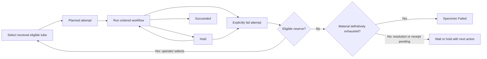

# Specimen tube selection and failure fallback

Status: implemented locally, September 11, 2026. Additive migration `20260911200711_AddSpecimenTubeAttempts` applied to the configured local development database. Full persisted journey, concurrency and rollout acceptance remain Not run. Customer-requested holds remain blocked.

## Product outcome

An order can contain specimens supplied in multiple physical tubes. For the first release, process one tube per specimen at a time, using a reserve only after the current attempt is explicitly failed. Carry this instruction from the order into laboratory work and enforce it throughout execution. Operators should see what is selected, what remains in reserve, what failed, and what they may do next.

Users are Customer/Partner order submitters, Phaeno order staff, receiving staff, laboratory Operators, Supervisors and scientific reviewers. The order captures the intended handling; receiving identifies each tube; laboratory staff select and process the source; reviewers see all attempts and the successful lineage.

## Settled scope and implementation defaults

Owner direction:

- Capture the tube-use policy on the order and reinforce it in the workflow.
- Initially support **Run one tube; use a reserve if the attempt fails**.
- Preserve the ability to add run-all or selected-subset policies later, without implementing them now.

Implementation defaults:

- One order-level policy applies to every specimen. No per-specimen override in this release. Show the policy explicitly; a tube count alone never means run every tube.
- Operators select the first eligible tube, and later the reserve, by verified barcode. Do not choose a physical tube merely by list order or automatically start another.
- A tube attempt spans the specimen's source-dependent ordered workflow. Completing its first protocol does not complete the attempt or unlock a second source tube.
- A permitted repeat or QC Hold remains within the current attempt. A failed QC reading alone does not trigger fallback.
- Closing an attempt as failed requires an eligible Operator/Supervisor, a reason and reference to the failed execution/evidence. An equipment incident may make the attempt unusable without proving the original tube physically defective; keep those dispositions distinct.
- Fallback starts the pinned workflow again from its first applicable stage with a different source tube. Reuse of upstream evidence across attempts is out of scope.
- After success, additional source-tube attempts are blocked. A later decision to redo successful work requires a separately designed rework process; no generic override here.

These defaults define a bounded first release. Scientific thresholds and protocol-specific criteria remain in approved protocols, not in the tube-selection policy.

## Implemented design

- Commercial orders retain nullable policy key/version; new and explicitly edited drafts use run-one/failure-fallback. Finalization carries policy through the V2 authorization and records explicit confirmation for older, unfinalized orders without rewriting their earlier placement snapshots. New Trial submissions use the same V2 instruction. V1 replay serialization omits the new null fields so accepted payload hashes retain their original meaning.
- Lab jobs retain policy and originating authorization revision. A Supervisor may explicitly adopt the instruction on an unstarted legacy job with confirmation and reason. Existing started history stays unlinked and visibly requires review; no inferred source or bulk cutover.
- `LabSpecimenAttempt` pins specimen/source/workflow and owns stage executions, explicit skips, holds, failure and success. Derived containers carry a typed attempt link, and libraries must resolve to that source through actual parent lineage.
- Work-level transactional advisory locking and optimistic concurrency protect commands alongside filtered unique constraints for specimen sequence, live/successful attempt, used source and attempt/stage. Command receipts retain actor and payload hash for idempotent retries. Start/evidence/resource writes share work/attempt concurrency guards.
- Existing matching first-stage Planned executions are adopted by source selection; no duplicate assignment. Later stages evaluate completion/skip evidence only within their own attempt. Failed outputs cannot enter replacement attempts, batching or release. Started attempts block protocol retirement between stages.
- Intake remains independent. Used source intake is locked after start; unused reserves remain reviewable. Pending material requires an owner/next action and deduplicated exception. Explicit exhaustion requires terminal attempt failure, no unresolved available tube and no expected unreceived tubes.
- POMS exposes customer sample IDs, received/expected/eligible counts, selected/reserve/unavailable tubes and attempt history through a dedicated specimen route. Actions use bounded confirmation forms and preserve entered data on conflicts.
- Barcode captures may explicitly require **Must match the selected source tube**. This optional definition field defaults off for older approved definitions; no meaning is inferred from labels or rewritten into approved history. Start always verifies the typed selected-source barcode. Captured barcodes that identify existing containers must resolve to the current attempt's lineage.

## Order policy and authorization

1. Add an explicit, versioned tube-use policy to the laboratory order's sample requirements. Display the one supported value with its plain-language explanation in creation, review and order details.
2. Preserve existing sample CSV columns; this is an order instruction, not another tube-count column. Do not create extra specimen records or billable service units for reserves.
3. Include the policy in the accepted order/authorization snapshot and the Lab authorization payload. Persist its source revision on the Lab job so later commercial edits cannot silently change laboratory instructions.
4. Validate the policy at authorization. Missing/unknown values produce an actionable setup error for new governed work, not an implicit run-all behavior.
5. Keep order modifications within the existing change/reapproval process. Freeze the policy after authorization for this first release; do not introduce unrestricted operational edits or change pricing/terms as part of this work.
6. Show the instruction in Customer/Partner order confirmation and POMS job details. Internal failure notes must not become customer-visible merely because the policy is shared.

## Receipt, tube eligibility and selection

- Continue receiving/accessioning each physical tube against its registered identity. Multiple tubes belong to one specimen; they do not create duplicate specimens.
- A selectable source must belong to this job and specimen, be a submitted specimen tube, have verified receipt/accession and suitable intake disposition, be physically available, and not be reserved by another attempt or previously exhausted under this policy.
- Add explicit tube-level acceptance/hold/rejection information where existing receipt evidence is insufficient. Preserve the existing physical-container status rather than overloading it with workflow roles.
- Display unavailable tubes with reasons: awaiting receipt, held, rejected, consumed, disposed, previously attempted, or identity unresolved.
- Evaluate received tubes independently across partial shipments. Missing reserves are not eligible. This policy does not impose a new requirement to wait for all declared tubes; retain any existing order/intake gate and expose its reason.
- Group received tubes beneath the recognizable specimen identifier. Resolve physical identity through existing external tube references and lineage before considering any legacy reconciliation; do not count every container card as a reserve.
- Confirm the selected barcode again at start. A source can be released/changed while its attempt is Planned and unstarted, with an audit event. Once started, the source is immutable.

## Attempt lifecycle

| State | Meaning | Permitted next actions |
| --- | --- | --- |
| No attempt | Specimen has no selected source | Select an eligible source; create Planned attempt and first-stage assignment together |
| Planned | Source reserved; no processing started | Review, start, or cancel/reselect before start |
| In progress | Workflow executing against the selected source | Record steps, permitted repeats, next eligible stage, hold, or explicit failure |
| On hold | Current attempt is unresolved | Resolve the hold and resume, or explicitly fail; no reserve may start |
| Failed | Attempt closed with reason/evidence | Select an eligible reserve through Use reserve tube |
| Succeeded | All required/applicable work and completion gates satisfied | Continue downstream review/release; no further source-tube attempt |
| Cancelled before start | Unstarted reservation released | Select a source again if work remains authorized |

Success is calculated from the pinned workflow's required stages and explicit optional/conditional decisions, including resolved QC and required traceability. It is not a manually toggled substitute for scientific approval or release.

On terminal failure:

1. Record actor, time, reason and evidence. Atomically close the attempt and prevent further writes to its operational executions.
2. Preserve completed steps, consumed materials, equipment use and all derived-container lineage. Exclude failed-attempt outputs from new workflow progression, batching and release; do not silently delete or physically dispose of them.
3. Offer Use reserve tube only when there is no active attempt and no successful attempt for the specimen.
4. Link the new attempt to its predecessor, increment its sequence, retain the job's workflow/protocol pins, and create only the first eligible stage.
5. If the attempt has terminally failed and no material remains for another permitted analysis, record the specimen processing outcome as **Failed**, with a controlled processing-failure reason such as material_exhausted and links to its attempt history. Do not leave definitively exhausted work On hold. If material is expected but not received, or a potentially usable tube needs a resolvable review, keep the specimen waiting/On hold with an explicit blocker, responsible owner and next action. A missing eligible tube alone is not proof of exhaustion. Later receipt or hold resolution never silently starts work. Retain a deduplicated exception where follow-up is required; exception closure does not rewrite the failed outcome.

## Intake acceptance, operational holds and final failure

Owner clarification, September 11, 2026:

- Intake acceptance answers whether at least one tube passed receipt checks. It is not the final processing result. Retain that intake history even if the specimen later fails analysis.
- A tube intake hold is a temporary unresolved issue with that tube. One held reserve does not hold intake acceptance when another tube is accepted.
- Specimen processing On hold means progress is temporarily blocked with a credible resolution path. It does not necessarily mean all tubes are questionable: some may be rejected or exhausted and the remaining potentially usable tube may be awaiting review. Record scope, cause, responsible owner and next action; do not use an unexplained generic status.
- Definitive terminal failure plus no remaining material for permitted analysis means specimen **Failed**, not On hold. Keep processing failure codes separate from intake codes.
- Customer-requested holds are a different business workflow. **Implementation is blocked** until the Product Owner approves its design and separately authorizes implementation. Do not add customer request/resume controls or treat generic Lab hold controls as an implemented customer-request workflow. See [Customer-requested specimen holds](CUSTOMER-SPECIMEN-HOLD-PLAN.md).

## Persisted model and contracts

Implemented model:

- Order/authorization/job: policy key and policy schema version, retained with the existing authorization revision.
- New `LabSpecimenAttempt`: job, specimen, source container, pinned workflow version, sequence, predecessor, state, author/time, start/close actor/time, failure reason/evidence, concurrency version.
- Specimen: separate processing outcome (including Failed), failure code/time/actor and evidence; preserve intake disposition separately. Serialize attempt ownership/current attempt and successful attempt reference, or use an equivalent constrained relation. Protect one active attempt across Planned/InProgress/OnHold and one successful attempt per specimen.
- Executions: typed attempt foreign key. The attempt establishes source identity; captured barcode evidence must match it. Derived libraries/outputs must resolve to the same attempt and source lineage.
- Tube intake: explicit suitability evidence if unavailable today; its actor, timestamp and reason remain distinct from attempt failure.
- Use UUID keys, snake_case mappings, restricted deletion and the existing audit/concurrency infrastructure. Add targeted uniqueness constraints for attempt sequence, active source reservation and allowed stage assignments.
- Version the Commercial-to-Lab authorization contract within this scoped change; update every producer/consumer and replay path. Do not mutate already accepted snapshot meaning.

No new dependencies or authentication mechanism are planned. Update `docs/database-erd.md` whenever the persisted model/migration is implemented.

## Enforcement and bypass prevention

Use one domain/application policy for allowed transitions and an API-provided eligibility summary for the UI. Client-side disabled buttons help explain a blocker; the server remains authoritative.

- Select/reserve tube, create attempt and assign stage 1 in one transaction.
- Serialize competing commands on the specimen and source container, with database uniqueness as a second guard. Reject stale clients with a useful conflict message; do not leave an orphan reservation/execution.
- Require idempotent transition requests or equivalent duplicate-command protection for selection, start, failure and reserve creation. Retries cannot create two attempts, consume two reserves or duplicate exhaustion exceptions.
- Require the same job, specimen, attempt and workflow pin for every stage. Earlier completed stages from a failed attempt must never satisfy the replacement attempt's prerequisites.
- Enforce across assignment, start, step capture, repeats, complete/abandon, material/equipment/derived-library recording, batching, manual processing milestones, scientific approval/release and relevant background/import paths.
- On a specimen covered by this policy, reject legacy direct assignments lacking an attempt. Work-order-scoped stages cannot stand in for specimen processing or satisfy its success gate.
- An ordinary execution Abandon must not silently authorize a reserve. Route active-attempt closure through the explicit failure/hold policy. Cancelling before any start is a distinct auditable operation.
- Guard specimen/tube hold and disposal changes against an active reservation. Hold affected work with a reason instead of leaving an eligible-looking source attached to an unusable tube.
- Workflow/protocol retirement must treat a started attempt, including a gap between completed and unassigned stages, as in process. Preserve existing queued-work warnings and explicit recovery requirements.
- Require current authorization and effective existing roles; no new broad override. Final scientific review retains its existing independent-review requirements.

## POMS workspace

Replace technical ambiguity with specimen-centered progress while retaining the six existing detail areas where useful.

- Navigation order: **Specimens → Tubes → Execution → Libraries → Exceptions → Review**. Intake inspection and decisions occur before storage during accessioning; Tubes displays those recorded facts. Lineage is shown in tube details and continues to accumulate during execution. Keep existing lineage links working.
- Before a Planned specimen execution starts, show **Tube acceptance required** and a direct **Open tubes** link to the job's Tubes tab when there is no accepted available input. Disable Start execution for that blocker, using the same server check as the start command. Recheck eligibility after accessioning; never accept or start work automatically. The attempt/source prerequisite additionally blocks unlinked Planned specimen work; accepting a tube alone does not select or start it.

- Header: Job, service, workflow name/version, visible tube-use instruction, specimen counts by readiness/progress, and next actionable step. Move internal record revision out of the main progress summary.
- Specimen rows: recognizable submitted sample ID, available/received/expected tube counts, selected source barcode, attempt number/state and clear blocker. Provide a view-first specimen/tube detail route for identity and attempt history; use bounded selection/failure modals.
- Acceptance is reviewed on each tube. A specimen is Accepted when at least one tube is Accepted; do not provide an independent specimen acceptance action. Keep specimen-wide processing holds separate.
- Tube list: selected, reserve, unavailable and previously attempted labels; show physical state separately. No ambiguous bare accession UUID as the sole identifier.
- Execution: protocol/stage name, specimen, source tube and attempt number instead of only an execution ID. Keep the exact pinned procedure visible and show the next permitted action.
- Fallback confirmation names the specimen, failed source, reason, selected reserve and restart point. Do not auto-select or auto-start on confirmation of failure.
- Preserve the agreed shaded header/list separation, compact Actions dropdowns, full-width bounded controls, keyboard/focus behavior, readable errors and responsive light/dark presentation.

## Existing data and rollout

1. Inventory existing orders, authorizations, tubes and executions read-only. Report ambiguous source mappings rather than guessing.
2. Add schema and nullable legacy links first. Existing orders remain visibly Policy not recorded until explicitly reconciled; no automatic assertion that they were ordered under the new policy.
3. New governed orders require the policy. Unstarted legacy work requires an explicit authorized policy confirmation and source selection before start. Preserve order snapshot history with a recorded amendment/legacy adoption event.
4. Existing started/completed executions retain their historical evidence. Do not fabricate tube selection or rewrite past results. Plan a review queue for unresolved legacy records; define a clear start/review gate without stopping ongoing work through an unreviewed bulk cutover.
5. Preserve local HS5Y7DB7, its workflow v1, nine specimens and existing containers. Its single Planned execution `9c32cbfc-46d6-49cb-8967-4c2a172c4e19` is unstarted and has no source selection. Reconcile it through an explicit UI operation that adopts it into an attempt; do not create a duplicate execution or repair it directly in SQL.
6. Local migrations follow repository verification rules; shared/staging/production migrations and deployment require explicit approval. Only the configured local additive migration has been applied; no shared migration or deployment.

## Delivery sequence and checkpoints

| Phase | Deliverable | Review checkpoint |
| --- | --- | --- |
| 1. Order instruction | Policy field, authorization snapshots, contract mapping and visible order summary | One-tube and multi-tube orders show the same explicit policy; reserves do not multiply ordered services |
| 2. Attempt foundation | Model, migration, source suitability/reservation, lifecycle and shared enforcement | Concurrent selection yields one active attempt; legacy records remain identifiable |
| 3. Guided execution | Attempt-aware assignment/progression, explicit failure, reserve selection and exhaustion exception | Tube 1 failure leads to a linked Tube 2 attempt starting at Stage 1 |
| 4. Workspace and documentation | Job summary, specimen/tube detail, meaningful execution labels and audience-specific guides | Operator can explain current source, reserve count and next action from the page |
| 5. Acceptance and rollout | Focused automated coverage when requested, manual acceptance, legacy-adoption review and release evidence | All required gates have evidence or an explicit Blocked/Not run status |

Backend guards and UI must ship together before enabling the policy for operational work. Do not expose a selector that promises exclusivity before its enforcement exists.

## Acceptance matrix

The cases below remain **Not run** unless the checkpoint explicitly records narrower evidence. Implementation is not a substitute for persisted acceptance.

| Case | Expected result |
| --- | --- |
| One specimen, one tube | Terminal attempt failure with no material for another permitted analysis makes the specimen Failed; reason and evidence retained |
| One specimen, three tubes | Operator selects one; two remain reserves; no automatic parallel assignment/start |
| Two operators select/start concurrently | Exactly one active attempt; losing request explains current reservation |
| Same request retried after response loss | Same result; no duplicate attempts, executions, consumption or exceptions |
| Hold or a repeatable failed QC reading | Current attempt retained; allowed same-attempt repeat; reserve blocked |
| Explicit failure at Stage 1 | Evidence retained; next selected tube starts a new linked Stage 1 attempt |
| Stage 1 succeeds, Stage 2 terminally fails | Replacement must redo Stage 1; failed attempt's completed stages do not satisfy it |
| Successful full attempt | Additional source attempts blocked; review and release use successful lineage |
| Unreceived, held, rejected, consumed, disposed, foreign or previously failed source | Selection/start rejected with specific reason |
| Mixed partial shipments | Only eligible arrived tubes offered; expected reserves shown separately; pending receipt is not reported as exhausted material |
| Potentially usable tube held after another fails | Temporary hold identifies resolution, owner and next action; no terminal specimen failure until exhaustion is established |
| Wrong barcode/derived parent | Start or output association rejected; no cross-specimen or cross-attempt lineage |
| Source becomes unavailable during start | Transaction conflict or explicit hold; no active execution on an invalid source |
| Legacy direct assignment or manual milestone bypass | Attempt/policy requirements still enforced |
| Workflow retirement between stages | Started specimen attempt blocks retirement even with no currently running execution |
| Job cancellation/hold or policy edit during processing | Authorization respected; no automatic reserve release/restart or policy replacement |
| Operator lacking permission | Server denies transition; UI does not expose unauthorized actions |
| Existing Planned execution adoption | One execution retained, source explicitly chosen, actor/reason retained |
| Historical started/completed work | No fabricated source or altered results; unresolved identity visibly flagged |
| Accessible workspace | Keyboard selection/confirmation, focus return, readable narrow layout, clear empty/blocker states |
| Customer/Partner/Phaeno documentation | Correct policy and audience-visible progress; no disclosure of internal evidence |

Completion criteria: no reproducible parallel-source or cross-attempt progression bypass; every new governed execution has resolvable source/attempt lineage; successful and exhausted specimen journeys are demonstrated through the UI; current actor/time/reason and independent scientific-review history are retained. Usability acceptance is the Product Owner being able to identify the selected tube, reserve count and next action without decoding database IDs.

## Local implementation checkpoint

The API and specimen page were inspected on preserved HS5Y7DB7. Recognizable TEST-001 through TEST-009 identities, 18 received tubes, the original pinned workflow and the existing unstarted execution remain visible. TEST-008 shows its actual tube TEST-HS5Y7DB7-016 and links the original Planned execution. The owner accepted a different specimen's tube during this work; that is not evidence that TEST-008 can start. No attempt, policy adoption, source selection or execution was saved by Codex during implementation.

Domain regression sources cover wrong barcode, QC/manual holds, immutable failed history, required-stage skip rejection and separate final processing/intake outcomes. Automated suites were not run. Build/static results and final read-only preservation checks are recorded in the walkthrough run record. Customer-requested holds, shared migration/deployment, full success/fallback/exhaustion acceptance, concurrent clients and production readiness remain separate gates.

## Explicit exclusions

Customer-requested hold implementation is explicitly blocked pending its separate design and authorization. This block does not halt the planned internal attempt/fallback work.

Run-all/run-subset policies, parallel replicates, pooling, automatic reserve selection, automatic scientific failure classification, reuse of failed-attempt outputs, reopening successful attempts, automatic physical disposal, changes to pricing, and bulk legacy repair are excluded. These require separate product decisions and acceptance criteria.

## Related plans

- [Lab Operations](LAB-OPERATIONS-PLAN.md)
- [Order Management](ORDER-MANAGEMENT-PLAN.md)
- [Sample Shipping and Intake](SAMPLE-SHIPPING-AND-INTAKE-PLAN.md)
- [Backend test plan](BACKEND-TEST-PLAN.md), [Frontend test plan](FRONTEND-TEST-PLAN.md), [E2E test plan](E2E-TEST-PLAN.md)
- [Laboratory manual acceptance](../testing/06-laboratory.md)
- [Current local walkthrough](../testing/runs/2026-09-11-protocol-preparation.md)

## Global action-button rule — September 11, 2026

All Portal record action menus now use the shared ActionMenu: zero visible items renders no control; one visible item renders its named button/link; two or more retain Actions. Permission filtering occurs before counting; disabled items remain disabled and count as visible. Preserve confirmation dialogs, trigger refs, link destinations, destructive styling and accessible labels. Navigation/selection menus are unchanged. Six focused shared-component tests passed. Verify representative role/status variants, keyboard activation, modal return focus and narrow/light/dark layouts during UAT. This is not a full application acceptance pass.

## Preparation batches and connected Library prep — scope recorded

See [Library preparation batches and connected workflow](LAB-WORK-JOURNEY-PLAN.md) for the agreed configurable single-tray model, mixed-job/partial batches, membership locked after start, batch-first evidence with tube exceptions, and reuse of preparation QC. The same implementation explicitly addresses disconnected container/resource entry, repeated identity linking, separate library creation/QC and sequencing handoff. This supersedes earlier open questions about tray continuity, mixed jobs, partial trays and duplicate QC in the journey plan. New preparation-batch behavior is planned, not implemented.
