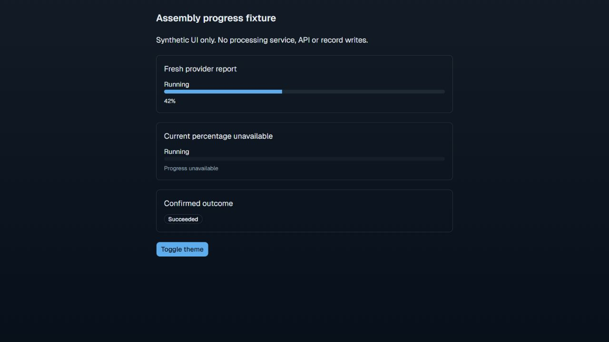

# Assembly progress presentation checkpoint

October 9, 2026. Frontend source and isolated synthetic UI verification only.

The shared progress component renders fresh provider percentages in existing
assembly list/detail controls and an indeterminate bar for absent/stale reports.
Confirmed terminal outcomes replace live progress. Reported 100% cannot imply
success, scientific QC or Customer release. Existing polling, freshness and
transient-history rules remain unchanged.

TypeScript and scoped ESLint pass. Phaeno help/corpus and frontend/browser test
plans are updated; automated suites were not requested or executed. Added test
source checks for missing/stale indeterminate progress and running 100% reports.
No backend, schema, authentication, processing provider or deployment changed.

The isolated preview used the actual `AssemblyJobProgress` component and synthetic
jobs. Observed fresh value `42`, absent value for **Progress unavailable**, and
terminal **Succeeded** without a percentage bar. Accessible names/value text,
light/dark styles and a measured 320px viewport with no horizontal overflow were
checked. No API, provider or scientific record writes occurred. The real DPS
connection remains unconfigured; preview results do not establish provider flow.

