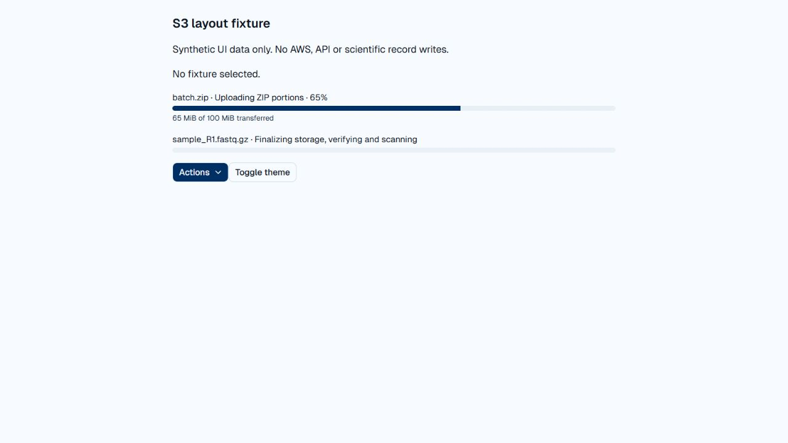
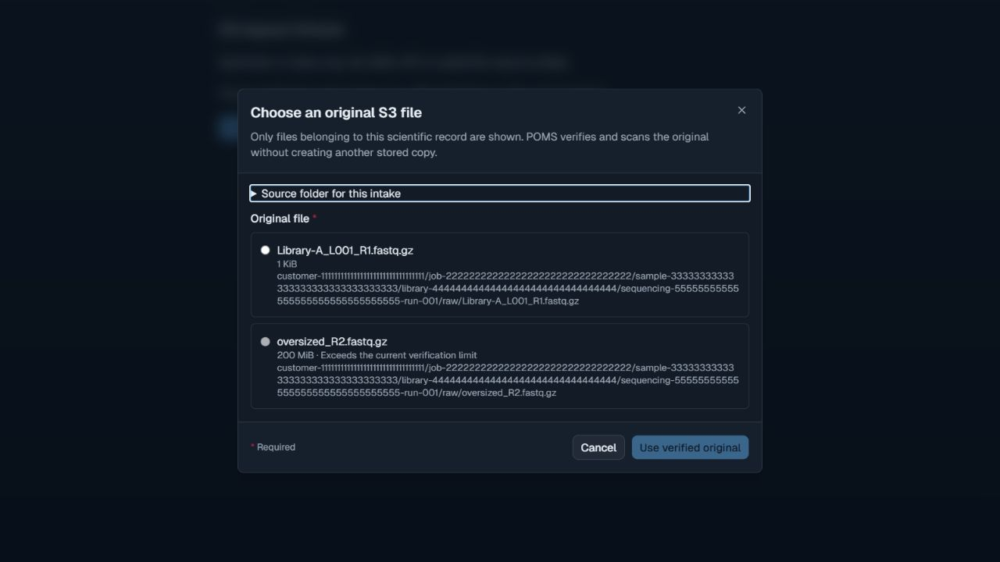

# S3 hierarchy, streaming and progress checkpoint

Date: October 9, 2026. Source/static verification and isolated UI preview only.
No scientific records, live file bytes, AWS configuration or hosted runtime were
changed. No automated unit/PostgreSQL/browser suite was executed.

Story: authorized Phaeno users upload scientific files or select exact S3
originals against a Customer/Job/sample/library/capture, retain raw inputs across
assembly attempts, and observe transfer separately from verification/extraction.

| Boundary | Evidence | Limit |
| --- | --- | --- |
| Backend/source contracts | Solution including test sources builds with zero warnings/errors. Scoped writes, storage-area locators, original version/ETag admission, bounded multipart buffers and completed-ZIP inspection compile. | No live multipart or scientific admission journey executed. |
| Browser UI | Isolated synthetic fixture showed one Actions chevron, keyboard opening, explicit radio selection, disabled over-limit original, required legend, header/body/footer regions, selection/Escape focus return and no horizontal overflow at 320 px. Light/dark chooser inspected. | Synthetic UI callbacks only; no API/AWS writes. |
| Upload progress | Native accessible progress names exposed measured `65%` / `65 MiB of 100 MiB`; verification progress omitted the value attribute. Themed bar and narrow reflow inspected. | Fixture values, not real transfer measurements. |
| Client/API response | TypeScript and scoped ESLint pass. GET/POST route names, scoped IDs, camel-case DTOs and envelope reads inspected. | Static trace; authenticated configured-provider flow pending. |
| Local data | Read-only transaction against configured loopback `phaeno_ops_recovery_20261008`: four scientific receipts/four FASTQ upload rows; bounded other file tables counted zero. Local provider/root remain active. | Current four files require preserving cutover; no locator conversion performed. |
| AWS environment | `phaeno-dev-01` region `us-east-2`, AES256, all four Public Access Block flags true; versioning not enabled, no lifecycle configuration, bucket contains objects. | Object contents were not read; originals cannot be admitted until exact object versions are available. |
| Documentation/scripts | Generated/check-passed 56-guide corpus `b61cdb910a92`; PowerShell launcher parses and preparation mode changes no runtime settings; edited Bash scripts pass syntax checks; diff whitespace check passes. | Hosted backup remains Local-only and requires S3-aware recovery before cutover. |

The SDK uses checksum-verified multipart parts and conditional completion. The
full-file SHA-256 in the application receipt is independently computed and is
not replaced by S3's composite multipart checksum. Small objects remain bounded
in memory; large writes use eight-MiB parts without an S3-writer disk spool.
Scientific verification and random-access ZIP work may use private temporary
files. ZIP bundles are prepared on the user's computer, uploaded, stored fully,
scanned/inspected, explicitly mapped and then extracted into separate files.

Activation requirements remain in the [implementation plan](../../plans/S3-STORAGE-AND-SCIENTIFIC-ACCESS-PLAN.md)
and separate [hosted cutover plan](../../plans/S3-HOSTED-CUTOVER-PLAN.md). The real
DPS provider is still unconfigured. Static/fixture evidence does not establish
scientific validity, retained source recovery or deployed functionality.
